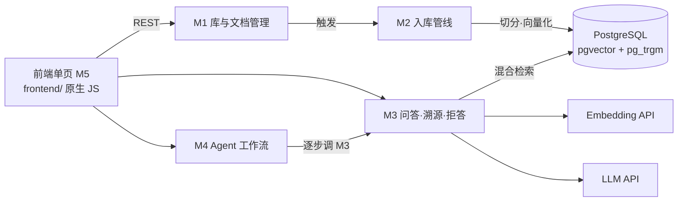

# KnowBase · 个人知识库问答系统

[](https://github.com/One-29/personal-knowledge-base/actions/workflows/ci.yml)

**自托管的个人知识库：把 Markdown 笔记喂给它，用自然语言提问，每个回答都附原文出处；知识库覆盖不了的问题，它明说不知道，不编造。**

后端已完整可用（M1–M4 + 评估 + CI），前端单页可用（M5）。产品背景与决策见 [docs/design/01-requirements.md](docs/design/01-requirements.md)。

## ✨ 核心特性

- **多知识库管理**：笔记按主题分库，导入与问答均可限定库范围
- **异步入库管线**：上传登记立即返回，切分与向量化后台执行，状态机可见（`pending/processing/ready/failed`）
- **结构感知切分**：按 Markdown 标题边界切块，块记录原文**字符偏移**作为溯源锚点
- **混合检索**：向量（pgvector HNSW/cosine）+ 关键词（pg_trgm GIN）双通道召回，RRF 融合排序
- **带引用的回答**：回答逐句标注 `[n]`，可定位到原文段落
- **防幻觉两道闸**：引用越界校验（纯规则，必执行）+ 零引用拒答
- **两级拒答**：阈值 τ（素材相关性）+ 生成后校验，五态拒答原因可查
- **会话追问**：同会话指代句自动改写为自包含问题（"那它怎么调？" → "TCP 拥塞窗口如何调整？"）
- **Agent 多步工作流**：跨文档综合任务自动拆步执行，**缺料步骤显式标注**，引用全局统一编号
- **可评估**：内置评估集与指标（recall@k / MRR / 拒答率 / τ 扫描），参数由数据校准

## 🚀 快速开始

### 1. 启动数据库（PostgreSQL 16 + pgvector + pg_trgm）

```bash
docker run -d --name knowbase-pg \
  -e POSTGRES_PASSWORD=postgres \
  -e POSTGRES_DB=knowbase \
  -e POSTGRES_HOST_AUTH_METHOD=trust \
  -p 5432:5432 \
  -v knowbase_pgdata:/var/lib/postgresql/data \
  pgvector/pgvector:pg16

# 跑测试需要一个独立测试库
docker exec knowbase-pg psql -U postgres -c "CREATE DATABASE knowbase_test;"
```

### 2. 安装依赖

```bash
python -m venv .venv
source .venv/bin/activate          # Windows: .venv\Scripts\activate
pip install -e ".[dev]"
```

### 3. 配置环境变量

复制 `.env.example` 为 `.env`，填入模型服务的密钥（`EMBEDDING_*` 与 `LLM_*`）：

```ini
DATABASE_URL=postgresql+psycopg://postgres@127.0.0.1:5432/knowbase
STORAGE_DIR=./data/storage
EMBEDDING_API_KEY=sk-xxx
EMBEDDING_BASE_URL=https://api.siliconflow.cn/v1
EMBEDDING_MODEL=BAAI/bge-m3
EMBEDDING_DIMENSION=1024
LLM_API_KEY=sk-xxx
LLM_BASE_URL=https://api.siliconflow.cn/v1
LLM_MODEL=deepseek-ai/DeepSeek-V4-Flash
```

> 任何 **OpenAI 兼容** 的 embedding / chat 服务都可以：换供应商只需改这三项配置，代码不变。
> ⚠️ embedding 模型决定向量维度——换模型需一次维度迁移（见 `alembic/versions/` 中的示例迁移）。

### 4. 建表并启动

```bash
alembic upgrade head
uvicorn app.main:app --reload      # 界面: http://127.0.0.1:8000/ui/  ·  API 文档: /docs
```

打开 <http://127.0.0.1:8000/ui/> 即可使用界面：**知识库**（新建/删除）→ **文档**（上传 .md、查看处理状态、重传）→ **问答**（选库提问、点引用 `[n]` 看原文）→ **工作流**（跨文档综合任务）。

### 5. 试一条完整链路

```bash
# 建库
curl -X POST http://127.0.0.1:8000/api/v1/kbs \
  -H "Content-Type: application/json" \
  -d '{"name": "计算机网络", "description": "计网课程笔记"}'

# 上传笔记（切分与向量化在后台进行）
curl -X POST http://127.0.0.1:8000/api/v1/kbs/1/documents \
  -F "file=@tcp.md"

# 提问（回答带引用；覆盖不足时 refused=true）
curl -X POST http://127.0.0.1:8000/api/v1/ask \
  -H "Content-Type: application/json" \
  -d '{"question": "TCP 为什么需要三次握手？", "kb_id": 1}'
```

## 🛠 技术栈

| 层 | 选型 | 说明 |
|---|---|---|
| 语言 / 框架 | Python 3.13 · FastAPI · Pydantic v2 | 异步 API、请求/响应契约 |
| 数据库 | PostgreSQL 16 · SQLAlchemy 2.x · Alembic | 迁移可重放；测试库独立 |
| 向量与检索 | pgvector 0.8（HNSW / cosine）· pg_trgm（GIN） | 单库同事务，向量与元数据一致备份 |
| Embedding | OpenAI 兼容 API（默认 `BAAI/bge-m3`，1024 维） | 全项目模型唯一 |
| 生成 | OpenAI 兼容 Chat API（默认 `deepseek-ai/DeepSeek-V4-Flash`） | 供应商可配 |
| 测试 / CI | pytest（91 项）· GitHub Actions（pgvector service container） | 测试不依赖真实密钥 |

## 📡 API 概览

| 方法 | 路径 | 说明 |
|---|---|---|
| POST / GET | `/api/v1/kbs` | 建库 / 库列表 |
| GET / DELETE | `/api/v1/kbs/{kb_id}` | 库详情 / 删库（级联清理文档与向量） |
| POST | `/api/v1/kbs/{kb_id}/documents` | 上传笔记（登记即返回，后台处理） |
| GET | `/api/v1/kbs/{kb_id}/documents` | 文档列表（可按状态/标题过滤） |
| GET / DELETE | `/api/v1/documents/{doc_id}` | 文档详情 / 删除 |
| POST | `/api/v1/documents/{doc_id}/reupload` | 重传覆盖（sha256 未变则幂等跳过） |
| GET | `/api/v1/documents/{doc_id}/content` | 原文读取 |
| **POST** | **`/api/v1/ask`** | **问答（带引用；覆盖不足返回 `refused=true`）** |
| GET | `/api/v1/citations/{chunk_id}` | 引用溯源（原文片段 + 字符区间） |
| **POST** | **`/api/v1/workflow`** | **多步综合任务（拆步、缺料可见、汇总）** |

## 🏗 架构



**模块边界**：M4 只编排不检索；M3 复用 M2 建好的索引；M2 不感知 HTTP；M1 只管元数据与原文。
完整划分与判据见 [docs/design/02-modules.md](docs/design/02-modules.md)。

## 📖 设计文档

设计先行：每个模块先出设计文档与子 Issue，再写代码、再提 PR。

| 文档 | 内容 |
|---|---|
| [docs/README.md](docs/README.md) | 文档体系与写作规范 |
| [docs/workflow.md](docs/workflow.md) | 开发流程（S0–S6、DoD、内容归属） |
| [01-requirements](docs/design/01-requirements.md) | 产品需求 PRD（定位/范围/NFR/用户故事/D1–D7） |
| [02-modules](docs/design/02-modules.md) | 模块拆分与业务边界 |
| [03-data-model](docs/design/03-data-model.md) | 数据模型（ER / DDL / 状态机 / DM1–DM6） |
| [04-retrieval](docs/design/04-retrieval.md) | 检索链路（切分 / embedding / 混合检索 / 防幻 / 拒答，DR1–DR6） |
| [05-agent-workflow](docs/design/05-agent-workflow.md) | Agent 多步工作流（AW1–AW5） |
| [06-evaluation](docs/design/06-evaluation.md) | 评估方案与首次评估结论（含 τ 校准） |

## 🧪 测试与评估

```bash
pytest -q                             # 91 项测试（独立测试库 + 事务回滚隔离）
python -m eval.run_eval               # 检索质量评估（recall@k / MRR / 拒答率 / τ 扫描）
python -m eval.run_eval --retrieval   # 只跑检索评估（不消耗 LLM）
```

**首次评估结果**（3 篇语料 / 12 条样本）：recall@8 = **1.000**、MRR = **1.000**、
库外拒答率 **100%**、库内误拒率 **0%**；据此把拒答阈值 τ 由 0.35 校准为 **0.45**。
详见 [06-evaluation](docs/design/06-evaluation.md)。

## 🗺 路线图

| 阶段 | 内容 | 状态 |
|---|---|---|
| M1 知识库与文档管理 | 库/文档 CRUD、原文存储、文档状态机 | ✅ 完成 |
| M2 入库管线 | 切分、向量化、索引写入与清理 | ✅ 完成 |
| M3 问答·溯源·拒答 | 混合检索、带引用生成、防幻觉、会话追问 | ✅ 完成 |
| M4 Agent 多步工作流 | 任务拆解、逐步执行、缺料可见、汇总 | ✅ 完成 |
| 06 检索质量评估 | 评估集、recall/MRR、τ 校准 | ✅ 完成 |
| CI/CD | GitHub Actions 自动化测试 | ✅ 完成 |
| **M5 前端** | 库/文档管理、问答与溯源高亮、工作流进度 | ✅ 完成（原生单页，零构建） |
| V1.0 | PDF/Word 导入、问答历史持久化、增量同步 | 规划 |

## 📄 License

[MIT](LICENSE)
