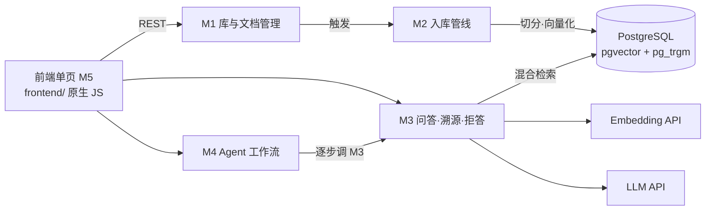

# KnowBase · 个人知识库问答系统

[](https://github.com/One-29/personal-knowledge-base/actions/workflows/ci.yml)

**自托管的个人知识库：把 Markdown 笔记喂给它，用自然语言提问，每个回答都附原文出处；知识库覆盖不了的问题，它明说不知道，不编造。**

后端已完整可用（M1–M4 + 评估 + CI），前端单页可用（M5）。产品背景与决策见 [docs/design/01-requirements.md](docs/design/01-requirements.md)。

## ✨ 核心特性

- **多知识库管理**：笔记按主题分库，导入与问答均可限定库范围
- **异步入库管线**：上传登记立即返回，切分与向量化后台执行，状态机可见（`pending/processing/ready/failed`）
- **结构感知切分**：按 Markdown 标题边界切块，块记录原文**字符偏移**作为溯源锚点
- **混合检索**：向量（pgvector HNSW/cosine）+ 关键词（pg_trgm GIN）双通道召回，RRF 融合排序
- **带引用的回答**：先给结论、再用资料里的机制/步骤/条件展开解释，每个论断标注 `[n]` 并可定位原文
- **防幻觉两道闸**：引用越界校验（纯规则，必执行）+ 零引用拒答
- **两级拒答**：阈值 τ（素材相关性）+ 生成后校验，五态拒答原因可查
- **会话追问**：指代句自动改写为自包含问题（"那它怎么调？" → "TCP 拥塞窗口如何调整？"）
- **会话记录本地保存**：多会话（新建/切换/删除）存在浏览器本地，刷新不丢；上下文随请求回传，当前界面不依赖服务端兼容会话的存活
- **可停止等待**：等待回答或任务时可点「停止」；这是客户端中断，服务端仍继续本次模型调用，详见[运行边界](docs/operations.md)
- **问答与工作流并发**：同一页面可同时运行一个普通问答和一个工作流；发起会话仍存在时，结果写回该会话，不会串到当前会话
- **Agent 多步工作流**：跨文档综合任务自动拆步执行，**缺料步骤显式标注**，引用全局统一编号
- **关联图**：Obsidian 式 graph view——节点是笔记、连线是语义关联强度（悬停看关联文档、可拖动、可调阈值）
- **可评估**：内置评估集与指标（recall@k / MRR / 拒答率 / τ 扫描），参数由数据校准

## 🚀 快速开始

### Windows 桌面一键启动

已经完成下面第 1–3 步的首次配置后，可以安装桌面快捷方式：

```powershell
powershell -NoProfile -ExecutionPolicy Bypass -File .\scripts\install-desktop-shortcut.ps1
```

之后双击桌面的 **KnowBase** 即可。启动器会依次完成以下工作：

1. 在 PATH 未配置时也会从 `%LOCALAPPDATA%\Programs\DockerDesktop`（包括本项目开发机的安装位置）寻找并启动 Docker Desktop；
2. 首次启动时创建 `knowbase-pg`，以后复用并启动该容器和 `knowbase_pgdata` 数据卷；
3. 等待 PostgreSQL 就绪，执行 `alembic upgrade head`；
4. 以单 worker 启动 KnowBase，健康检查通过后自动打开 <http://127.0.0.1:8000/ui/>。

运行期间请保留启动窗口；按 `Ctrl+C` 可停止 API。Docker Desktop 和数据库容器会继续运行，下一次启动可直接复用。若 `.venv` 或 `.env` 尚未配置，窗口会保留明确的修复提示。安装脚本可以重复执行，用于刷新移动仓库后的快捷方式路径。

### 1. 启动数据库（PostgreSQL 16 + pgvector + pg_trgm）

```bash
docker run -d --name knowbase-pg \
  -e POSTGRES_PASSWORD=postgres \
  -e POSTGRES_DB=knowbase \
  -e POSTGRES_HOST_AUTH_METHOD=trust \
  -p 5432:5432 \
  -v knowbase_pgdata:/var/lib/postgresql/data \
  pgvector/pgvector:pg16

# 跑测试需要一个独立测试库
docker exec knowbase-pg psql -U postgres -c "CREATE DATABASE knowbase_test;"
```

### 2. 安装依赖

```bash
python -m venv .venv
source .venv/bin/activate          # Windows: .venv\Scripts\activate
pip install -e ".[dev]"
```

### 3. 配置环境变量

复制 `.env.example` 为 `.env`，填入模型服务的密钥（`EMBEDDING_*` 与 `LLM_*`）：

```ini
DATABASE_URL=postgresql+psycopg://postgres@127.0.0.1:5432/knowbase
STORAGE_DIR=./data/storage
EMBEDDING_API_KEY=sk-xxx
EMBEDDING_BASE_URL=https://api.siliconflow.cn/v1
EMBEDDING_MODEL=BAAI/bge-m3
EMBEDDING_DIMENSION=1024
LLM_API_KEY=sk-xxx
LLM_BASE_URL=https://api.siliconflow.cn/v1
LLM_MODEL=deepseek-ai/DeepSeek-V4-Flash
```

> 任何 **OpenAI 兼容** 的 embedding / chat 服务都可以：换供应商只需改这三项配置，代码不变。
> ⚠️ embedding 模型决定向量维度——换模型需一次维度迁移（见 `alembic/versions/` 中的示例迁移）。

### 4. 建表并启动

```bash
alembic upgrade head
uvicorn app.main:app --reload      # 界面: http://127.0.0.1:8000/ui/  ·  API 文档: /docs
```

演示时使用 `uvicorn app.main:app --workers 1`，避免修改文件触发开发热重载。当前按**单 worker**运行：兼容会话和后台入库任务均在进程内，不能直接通过增加 worker 获得可靠的跨进程会话与任务恢复。停止语义、连接池设置、旧文档重建说明见[运行与维护](docs/operations.md)。

打开 <http://127.0.0.1:8000/ui/> 即可使用界面：**知识库**（新建/删除）→ **文档**（上传 .md、查看处理状态、重传）→ **问答**（选库提问、点引用 `[n]` 看原文）→ **工作流**（跨文档综合任务）→ **关联图**（查看文档语义关系并调整阈值）。

### 5. 加载高等数学演示库

仓库内置 8 篇“大一上高等数学”Markdown 笔记。数据库和 Embedding 配置可用后，在 PowerShell 执行：

```powershell
powershell -NoProfile -ExecutionPolicy Bypass -File .\scripts\load-calculus-demo.ps1
```

加载器会先完整构建临时知识库，所有文档均进入 `ready` 后才替换同名旧演示库。它不会修改其它知识库，并会输出四档关联图的节点和边数。使用项目示例模型 `BAAI/bge-m3` 对当前语料重新计算的结果为：阈值 0.60 / 0.68 / 0.72 / 0.76 分别显示 23 / 17 / 10 / 1 条边。演示问题、工作流任务和操作顺序见[高等数学演示指南](docs/demo.md)。

### 6. 试一条完整链路

```bash
# 建库
curl -X POST http://127.0.0.1:8000/api/v1/kbs \
  -H "Content-Type: application/json" \
  -d '{"name": "计算机网络", "description": "计网课程笔记"}'

# 上传笔记（切分与向量化在后台进行）
curl -X POST http://127.0.0.1:8000/api/v1/kbs/1/documents \
  -F "file=@tcp.md"

# 提问（回答带引用；覆盖不足时 refused=true）
curl -X POST http://127.0.0.1:8000/api/v1/ask \
  -H "Content-Type: application/json" \
  -d '{"question": "TCP 为什么需要三次握手？", "kb_id": 1}'
```

## 🛠 技术栈

| 层 | 选型 | 说明 |
|---|---|---|
| 语言 / 框架 | Python 3.13 · FastAPI · Pydantic v2 | 同步业务路由由线程池执行、请求/响应契约 |
| 数据库 | PostgreSQL 16 · SQLAlchemy 2.x · Alembic | 迁移可重放；测试库独立 |
| 向量与检索 | pgvector 0.8（HNSW / cosine）· pg_trgm（GIN） | 单库同事务，向量与元数据一致备份 |
| Embedding | OpenAI 兼容 API（默认 `BAAI/bge-m3`，1024 维） | 全项目模型唯一 |
| 生成 | OpenAI 兼容 Chat API（默认 `deepseek-ai/DeepSeek-V4-Flash`） | 供应商可配 |
| 测试 / CI | pytest · GitHub Actions（pgvector service container） | 测试不依赖真实密钥 |

## 📡 API 概览

| 方法 | 路径 | 说明 |
|---|---|---|
| POST / GET | `/api/v1/kbs` | 建库 / 库列表 |
| GET / DELETE | `/api/v1/kbs/{kb_id}` | 库详情 / 删库（级联清理文档与向量） |
| POST | `/api/v1/kbs/{kb_id}/documents` | 上传笔记（登记即返回，后台处理） |
| GET | `/api/v1/kbs/{kb_id}/documents` | 文档列表（可按状态/标题过滤） |
| GET / DELETE | `/api/v1/documents/{doc_id}` | 文档详情 / 删除 |
| POST | `/api/v1/documents/{doc_id}/reupload` | 重传覆盖（sha256 未变则幂等跳过） |
| GET | `/api/v1/documents/{doc_id}/content` | 原文读取 |
| **POST** | **`/api/v1/ask`** | **问答（带引用；覆盖不足返回 `refused=true`）** |
| GET | `/api/v1/citations/{chunk_id}` | 引用溯源（原文片段 + 字符区间） |
| **POST** | **`/api/v1/workflow`** | **多步综合任务（拆步、缺料可见、汇总）** |
| GET | `/api/v1/graph` | 关联图数据（节点=文档，边=语义关联强度） |

## 🏗 架构



**模块边界**：M4 只编排不检索；M3 复用 M2 建好的索引；M2 不感知 HTTP；M1 只管元数据与原文。
完整划分与判据见 [docs/design/02-modules.md](docs/design/02-modules.md)。

## 📖 设计文档

设计先行：每个模块先出设计文档与子 Issue，再写代码、再提 PR。

| 文档 | 内容 |
|---|---|
| [docs/README.md](docs/README.md) | 文档体系与写作规范 |
| [docs/workflow.md](docs/workflow.md) | 开发流程（S0–S6、DoD、内容归属） |
| [docs/operations.md](docs/operations.md) | 运行边界、卡住排查、旧文档重建与后续优化建议 |
| [01-requirements](docs/design/01-requirements.md) | 产品需求 PRD（定位/范围/NFR/用户故事/D1–D7） |
| [02-modules](docs/design/02-modules.md) | 模块拆分与业务边界 |
| [03-data-model](docs/design/03-data-model.md) | 数据模型（ER / DDL / 状态机 / DM1–DM6） |
| [04-retrieval](docs/design/04-retrieval.md) | 检索链路（切分 / embedding / 混合检索 / 防幻 / 拒答，DR1–DR6） |
| [05-agent-workflow](docs/design/05-agent-workflow.md) | Agent 多步工作流（AW1–AW5） |
| [06-evaluation](docs/design/06-evaluation.md) | 评估方案与首次评估结论（含 τ 校准） |
| [07-frontend-design](docs/design/07-frontend-design.md) | 前端界面设计（token 系统 / 关键决策） |
| [08-graph-view](docs/design/08-graph-view.md) | 关联图设计（边的计算 / 权重合成 / 决策） |

## 🖥 界面

前端是单页应用（`frontend/`，原生 HTML/CSS/JS，零构建），五个视图：**问答**（引用编号可点，原文显示在常驻边注栏）、**工作流**（步骤序列 + 缺料标注）、**关联图**（文档语义关系）、**文档**（清单 + 处理状态）、**知识库**（新建/删除）。

设计取向：界面隐喻为「**纸面与页边注**」——笔记与引文的现实形态是手稿与文献，因此回答是正文、`[n]` 是上标引文、**原文是页边注**。核对原文是产品的核心动作，所以边注栏常驻而非弹窗。设计 token 与决策见 [07-frontend-design](docs/design/07-frontend-design.md)。

启动后打开 <http://127.0.0.1:8000/ui/> 即可使用（根路径会自动跳转）。

## 🧪 测试与评估

```powershell
pytest -q
powershell -NoProfile -ExecutionPolicy Bypass -File .\scripts\run-eval.ps1 -Retrieval
powershell -NoProfile -ExecutionPolicy Bypass -File .\scripts\run-eval.ps1
```

数据按用途隔离：

| 用途 | PostgreSQL 数据库 | 原文目录 | 日常界面是否可见 |
|---|---|---|---:|
| 个人资料与演示库 | `knowbase` | `data/storage` | 是 |
| pytest 数据库集成测试 | `knowbase_test` | `data/test-storage-*` | 否 |
| 检索与拒答评估 | `knowbase_eval` | `data/eval-storage` | 否 |

数据库集成测试会重建独立的 `knowbase_test` 表结构。没有 PostgreSQL 时可先运行 `pytest -q tests/test_chunking.py tests/test_embedding.py`；这部分通过不能替代事务恢复、查询与 API 的数据库集成验证。

`run-eval.ps1` 会幂等创建 `knowbase_eval`、执行迁移，并只在子进程内覆盖数据库和原文目录。`eval.run_eval` 也有强制保护：配置与实际连接都必须指向 `knowbase_eval`，原文目录必须精确为项目内的 `data/eval-storage`，否则会在任何业务查询和删除前拒绝执行。评估语料会先在临时库中全部处理为 `ready`，再替换旧评估库，避免用半成品语料输出误导性的低分。完整评估真实调用 Embedding 和 LLM；`-Retrieval` 只运行检索评估，不调用回答模型。

**首次评估结果**（3 篇语料 / 12 条样本）：recall@8 = **1.000**、MRR = **1.000**、
库外拒答率 **100%**、库内误拒率 **0%**；据此把拒答阈值 τ 由 0.35 校准为 **0.45**。
详见 [06-evaluation](docs/design/06-evaluation.md)。

这是早期小样本结论。2026-09-14 已在隔离的 `knowbase_eval` 中用修正后的来源文档判断和 MRR 分母重跑检索部分，结果仍为 recall@8=1.000、MRR=1.000；拒答率与 τ 分布尚未重新完整评估，也不能用 3 篇语料推断真实多库表现。详见[评估方案](docs/design/06-evaluation.md#6-评估结论)。

## 🗺 路线图

| 阶段 | 内容 | 状态 |
|---|---|---|
| M1 知识库与文档管理 | 库/文档 CRUD、原文存储、文档状态机 | ✅ 完成 |
| M2 入库管线 | 切分、向量化、索引写入与清理 | ✅ 完成 |
| M3 问答·溯源·拒答 | 混合检索、带引用生成、防幻觉、会话追问 | ✅ 完成 |
| M4 Agent 多步工作流 | 任务拆解、逐步执行、缺料可见、汇总 | ✅ 完成 |
| 06 检索质量评估 | 评估集、recall/MRR、τ 校准 | ✅ 完成 |
| CI/CD | GitHub Actions 自动化测试 | ✅ 完成 |
| **M5 前端** | 库/文档管理、问答与溯源高亮、工作流进度 | ✅ 完成（原生单页，零构建） |
| V1.0 | PDF/Word 导入、问答历史持久化、增量同步 | 规划 |

## 📄 License

[MIT](LICENSE)
