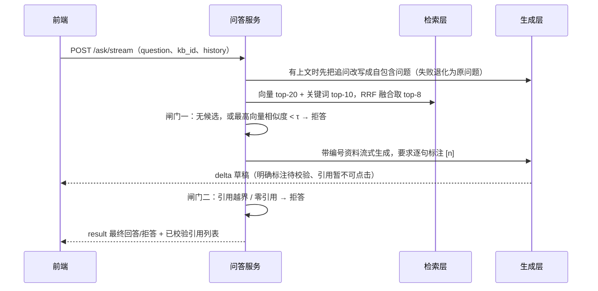
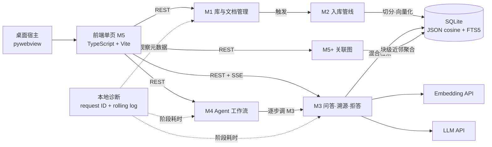

# 00-项目总览

| 字段 | 内容 |
|---|---|
| 状态 | 已确认（既有事实汇总） |
| 版本 | v0.8 |
| 日期 | 2026-09-25 |
| 上游 | `01-requirements.md` |
| 变更 | v0.8：普通问答加入 POST SSE 增量传输与最终引用校验门；v0.7：加入 Windows PyInstaller 单目录包、配置隔离与冻结包启动门；v0.6：加入持久入库任务、真实阶段进度与重启恢复；v0.5：加入本地滚动日志、请求关联与隐私安全诊断摘要 |
| 关联 | GitHub 总功能 Issue |

> 本文是**项目总览**：给第一次打开仓库的人一份几分钟能读完的全貌，细节一律指向对应设计文档。
> 事实的单一来源仍是各设计文档，本文只做摘要与索引，不重复推演论证过程。

## 1. 定位

> 一个自托管的个人知识库：把 Markdown 笔记喂给它，用自然语言提问，
> 每个回答都附原文出处可核对；知识库覆盖不了的问题，它明说不知道，不编造。

（引自 `01-requirements.md` §1.2。定位三原则：不是编辑器、不是云协作平台、可信优先于聪明。）

## 2. 它解决什么问题

笔记越积越多之后会暴露三个具体痛点（`01-requirements.md` §1.1）：

| 痛点 | 表现 | 本项目的应对 |
|---|---|---|
| 找不到 | 只记得记过这件事，不记得在哪篇、哪一段 | 语义检索 + 引用直接定位到原文字符区间 |
| 问不了 | 全文搜索只能命中关键词，回答不了「区别是什么」这类问题 | 混合检索 + 生成式问答 |
| 不敢信 | 通用模型能答，但无法确认它是否基于「我的材料」 | 每个论断标注 `[n]`，覆盖不足直接拒答 |

## 3. 现在能做什么

| 能力 | 说明 |
|---|---|
| 多知识库管理 | 笔记按主题分库，导入与提问均可限定范围 |
| 异步入库 | 上传登记即返回，切分与向量化在后台执行，状态可见（`pending/processing/ready/failed`） |
| 安全重传 | 新原文写入不可变候选文件，块与原文成功后在同一事务切换；失败继续使用匹配的旧原文和旧块 |
| Markdown 本地图片 | 一篇 Markdown 与静态 PNG/JPEG/WebP 可组成 ZIP 导入；保留原图、顺序和字符位置，完整原文与引用均可查看 |
| 结构感知切分 | 按 Markdown 标题边界切块，块记录原文**字符偏移**作为溯源锚点 |
| 混合检索 | SQLite JSON 精确余弦 + FTS5 trigram 双通道召回，RRF 融合排序；PostgreSQL 后端保留作迁移对照 |
| 带引用回答 | 先结论、再用资料里的机制/步骤/条件展开，每个论断标注 `[n]` 并可定位原文 |
| 流式问答 | L1 检索门通过后逐段显示生成草稿，完整内容经 L2 引用校验后才发布为最终回答 |
| 会话追问 | 指代句自动改写为自包含问题（「那它怎么调？」→「TCP 拥塞窗口如何调整？」） |
| 会话记录本地保存 | 多会话（新建/切换/删除）存在浏览器本地，刷新不丢；上下文随请求回传 |
| 可停止等待 | 等待回答或任务时可点「停止」；这是客户端中断，服务端仍继续本次模型调用 |
| Agent 多步工作流 | 跨文档综合任务自动拆步执行，**缺料步骤显式标注**，引用全局统一编号 |
| 关联图 | Obsidian 式 graph view：节点是笔记、连线是语义关联强度（悬停看关联文档、可拖动、可调阈值） |
| 可评估 | 内置评估集与指标（recall@k / MRR / 拒答率 / τ 扫描），参数由数据校准 |
| 原生桌面窗口 | pywebview 承载同一套 TypeScript 界面；单实例、API 就绪门与关窗退出已经接通，Windows 单目录包无需本机 Python/Node.js |
| 可诊断 | 本地滚动日志用请求 ID 串起总耗时和模型/检索/索引阶段；界面一键复制不含密钥与知识正文的摘要 |

## 4. 怎么做到「不编造」

一次提问的完整链路（设计依据见 `04-retrieval.md`）：

图注：**闸门一（素材够不够）是数值判定，闸门二（回答能不能核对）是纯规则判定**。模型生成不可控，校验必须可控——这是全项目的可信性基础。

拒答是正常业务结果：HTTP 200 + `refused=true`，并给出六种原因之一——
`empty_kb`（库空或无命中）/ `low_relevance`（低于阈值 τ，或模型自述资料不足）/
`invalid_citation`（引用越界）/ `no_citation`（有内容却零引用，不可溯源）/
`llm_unavailable` / `embedding_unavailable`。

## 5. 架构与模块边界

图注：依赖只向下、无环。前端只消费 HTTP 契约；M4 只编排不检索；M3 是检索与判定的唯一入口；M2 不感知 HTTP；M1 只管元数据与原文。

完整划分、判据与跨模块时序见 `02-modules.md`，数据模型见 `03-data-model.md`。

## 6. 界面

前端是单页应用（`frontend/`，HTML5 + CSS Grid/Flexbox + 严格 TypeScript，无运行时框架与外部 CDN），由 Vite 构建后交给 FastAPI 托管。源码按 API、会话、导航、知识库/文档、问答/工作流、关联图和原文核对拆包。三栏研究工作台的左栏显示功能与并发任务状态，中间承载业务视图，右侧用于原文核对。五个视图为 **问答**、**工作流**、**关联图**、**文档**、**知识库**。Windows 源码运行可由 pywebview 打开系统原生窗口；桌面宿主只管理单实例、后台 API 与窗口生命周期，浏览器开发模式继续可用。

普通问答和工作流可各运行一个并同时在途，切换视图后左栏仍显示各自计时状态。普通问答通过 fetch 读取 POST SSE，网络分片先由独立解析器还原事件；模型增量仅按不可点击草稿渲染，最终 `result` 才绑定引用和保存会话。桌面端原文栏常驻且可调宽，平板与手机端改为默认收起的按需抽屉。回答内容先进行 HTML 转义，再渲染标题、列表、代码、公式文本与引用，避免执行模型返回的 HTML。设计细节见 `07-frontend-design.md` 与 `08-graph-view.md`。

## 7. API 概览

| 方法 | 路径 | 说明 |
|---|---|---|
| POST / GET | `/api/v1/kbs` | 建库 / 库列表 |
| GET / DELETE | `/api/v1/kbs/{kb_id}` | 库详情 / 删库（级联清理文档与向量） |
| POST | `/api/v1/kbs/{kb_id}/documents` | 上传笔记（登记即返回，后台处理） |
| GET | `/api/v1/kbs/{kb_id}/documents` | 文档列表（可按状态/标题过滤） |
| GET / DELETE | `/api/v1/documents/{doc_id}` | 文档详情 / 删除 |
| POST | `/api/v1/documents/{doc_id}/reupload` | 重传覆盖（sha256 未变则幂等跳过） |
| GET | `/api/v1/documents/{doc_id}/content` | 原文读取 |
| GET | `/api/v1/documents/{doc_id}/versions/{version}/images/{ordinal}` | 读取不可变文档版本中的原图 |
| **POST** | **`/api/v1/ask`** | **问答（带引用；覆盖不足返回 `refused=true`）** |
| **POST** | **`/api/v1/ask/stream`** | **SSE 问答（`metadata` → `delta`* → 最终 `result`；同步契约仍保留）** |
| GET | `/api/v1/citations/{chunk_id}` | 引用溯源（原文片段 + 字符区间） |
| **POST** | **`/api/v1/workflow`** | **多步综合任务（拆步、缺料可见、汇总）** |
| GET | `/api/v1/graph` | 关联图数据（节点 = 文档，边 = 语义关联强度） |
| GET | `/api/v1/diagnostics` | 可复制诊断摘要（无密钥、问题、回答、标题或原文） |
| GET | `/health` · `/ready` | 存活探针（仅 API）/ 就绪探针（API + 数据库） |

交互式契约文档：`http://127.0.0.1:8000/docs`。

## 8. 技术栈

| 层 | 选型 | 说明 |
|---|---|---|
| 语言 / 框架 | Python 3.13 · FastAPI · Pydantic v2 | 同步业务路由由线程池执行、请求/响应契约分离 |
| 日常数据库 | SQLite · SQLAlchemy 2.x · schema version | 用户目录单文件、WAL、外键；无需独立服务 |
| 向量与检索 | JSON 精确余弦 · FTS5 trigram/BM25 | 个人规模零扩展；PostgreSQL + pgvector/pg_trgm 保留作迁移与质量对照 |
| 文档与图片校验 | Python `zipfile` · Pillow | 限量读取 ZIP，校验路径/CRC/压缩比与静态图片完整性；原图不重编码 |
| Embedding | OpenAI 兼容 API（默认 `BAAI/bge-m3`，1024 维） | 全项目模型唯一 |
| 生成 | OpenAI 兼容 Chat API + SSE（默认 `deepseek-ai/DeepSeek-V4-Flash`） | 供应商可配；不支持流式的兼容服务退回单段结果 |
| 桌面宿主 | pywebview 6.x · PyInstaller 6.x · 系统 WebView2 | 源码壳与 Windows 独立包已接通；签名、自动更新和 macOS/Linux 发布尚未完成 |
| 本地诊断 | Python logging · RotatingFileHandler · ASGI middleware | 用户目录轮转、凭据脱敏、请求 ID 与阶段耗时；无远程遥测 |
| 入库任务 | SQLAlchemy 状态表 · FastAPI BackgroundTasks | 版本化原子领取、五阶段进度、单 worker 启动恢复 |
| 测试 / CI | pytest · GitHub Actions（pgvector service container） | 测试不依赖真实密钥 |

## 9. 边界与已知取舍

写清楚现在做不到什么，比多列一条功能有用。运行边界与排查方式另见 `../operations.md`。

| 边界 | 现状与原因 |
|---|---|
| 单 worker | 兼容会话仍在进程内；入库状态可跨重启恢复，但执行承载没有多 worker 租约、心跳与抢占协议 |
| 「停止」按钮 | 立即中断客户端读取，但同步供应商调用没有可靠取消令牌；上游请求仍可能继续并计费 |
| 问答历史 | 存在浏览器本地并随请求回传，服务端不落库（刷新不丢，换设备不通用） |
| 工作流执行 | MVP 同步执行，无断点恢复；长任务异步化留 V1.0 |
| 关联图规模 | 参与近邻计算的块最多 400 个，超出时响应里标注 `truncated` |
| 评估结论 | v2 固定基线为 5 库 / 20 文档 / 60 条样本；可用于回归对比，仍不能替代真实用户语料 |
| 文档格式 | 支持 Markdown / txt，以及“单篇 Markdown + 本地静态图片”的 ZIP；PDF、Word、OCR 与图片语义解析留给后续版本 |
| 桌面发布 | Windows 单目录 ZIP 已可构建并通过隔离启动门；尚无正式签名、自动更新、Releases 自动上传或 macOS/Linux 二进制 |

## 10. 评估结论摘要

**v2 检索基线**（5 个库 / 20 篇文档 / 60 条分层样本）：PostgreSQL recall@8 为
**1.000（50/50）**、MRR = **0.987**；日常 SQLite 为
**1.000（50/50）**、MRR = **1.000**。库内最高相似度最低约为 0.543，库外最高约为
0.493；据此把 L1 拒答阈值从 0.45 重新校准为 **0.50**，离线扫描得到库外拒答率
100%、库内误拒率 0%。

本轮是 retrieval 模式，没有在 v2 全量样本上调用回答 LLM；L2 拒答结果仍需单独归档。
旧的 3 文档 / 12 样本完整评估只作为历史记录。

评估方法、指标口径与后续计划见 `06-evaluation.md`。

## 11. 进度

| 阶段 | 内容 | 状态 |
|---|---|---|
| M1 知识库与文档管理 | 库/文档 CRUD、原文存储、文档状态机 | ✅ 完成 |
| M2 入库管线 | 切分、向量化、索引写入与清理 | ✅ 完成 |
| M3 问答·溯源·拒答 | 混合检索、流式带引用生成、防幻觉、会话追问 | ✅ 完成 |
| M4 Agent 多步工作流 | 任务拆解、逐步执行、缺料可见、汇总 | ✅ 完成 |
| 06 检索质量评估 | 评估集、recall/MRR、τ 校准 | ✅ 完成 |
| CI/CD | GitHub Actions 自动化测试 | ✅ 完成 |
| M5 前端 | 库/文档管理、问答与溯源高亮、工作流进度 | ✅ 完成（TypeScript 模块化单页，Vite 构建） |
| Windows 桌面发布 | pywebview、单实例、冻结运行时、配置隔离、API/WebView 双启动门 | ✅ 完成（单目录 ZIP） |
| 本地诊断 | 滚动日志、脱敏、请求关联、阶段耗时、复制摘要 | ✅ 完成 |
| V1.0 | Windows Releases、跨平台包、PDF/Word 导入 | 规划 |

## 12. 文档索引

设计先行：每个模块先出设计文档与子 Issue，再写代码、再提 PR。

| 文档 | 内容 |
|---|---|
| `../README.md` | 文档体系与写作规范（先读这里） |
| `../workflow.md` | 开发流程（S0–S6、DoD、内容归属） |
| `../operations.md` | 运行边界、卡住排查、旧文档重建与后续优化建议 |
| `../demo.md` | 高等数学演示库：问答/工作流示例与关联图阈值 |
| `../image-packages.md` | Markdown 本地图片 ZIP 的目录格式、限制、保留策略与排错 |
| `01-requirements.md` | 产品需求 PRD（定位/范围/NFR/用户故事/D1–D7） |
| `02-modules.md` | 模块拆分与业务边界 |
| `03-data-model.md` | 数据模型（ER / DDL / 状态机 / DM1–DM6） |
| `04-retrieval.md` | 检索链路（切分 / embedding / 混合检索 / 防幻 / 拒答，DR1–DR6） |
| `05-agent-workflow.md` | Agent 多步工作流（AW1–AW5） |
| `06-evaluation.md` | 评估方案与首次评估结论（含 τ 校准） |
| `07-frontend-design.md` | 前端界面设计（token 系统 / 关键决策） |
| `08-graph-view.md` | 关联图设计（边的计算 / 权重合成 / 决策） |
