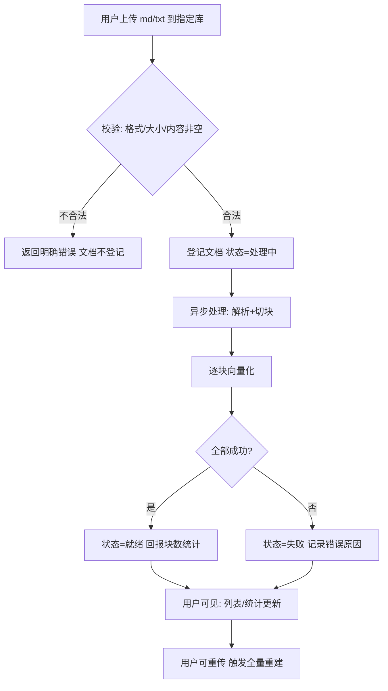
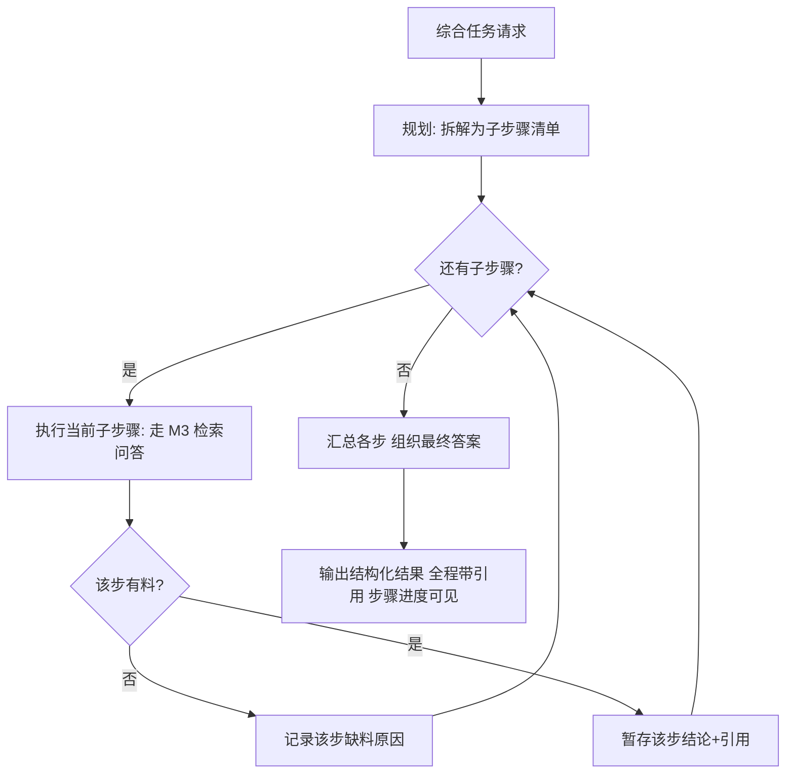

# 01-需求定义（PRD v0.4 草案）

| 字段 | 内容 |
|---|---|
| 状态 | 草案（需求层冻结候选：全部决策已拍板） |
| 版本 | v0.4 |
| 日期 | 2026-09-06 |
| 上游 | 无（根文档） |
| 变更 | v0.4：PD1–PD4 拍板并入决策记录 D4–D7，需求层决策冻结；v0.3 产品化重写（定位/画像/术语表/NFR/演进路线） |
| 关联 | GitHub 总功能 Issue（建仓后建立） |

> 本文是需求层的唯一来源。阅读顺序：01 → 02 → 03+。写作规范见 `docs/README.md`。
> 项目约束背景：作为后端学习主线的实践产品开发，里程碑由年度目标驱动（见 §7）。

## 1. 产品概述

### 1.1 问题与机会

个人知识工作者（学生、研究者、内容生产者）的笔记散落在本地 Markdown 文件中，越积越多后暴露三个痛点：

1. **找不到**：只记得"我记过这件事"，不记得在哪篇文件、哪个段落。
2. **问不了**：全文搜索只能按关键词命中，无法回答"我当时对 TCP 拥塞控制总结过哪几个要点"这类语义问题。
3. **不敢信**：用通用 AI 问答可以拿到答案，但无法确认它是否基于"我的材料"——没有溯源，就没有可信度。

**机会**：本地文档 + 语义检索 + 生成式问答已是成熟技术组合，但现有方案要么绑定云端与协作场景（Notion AI、飞书知识库），要么面向团队（Quivr、AnythingLLM）。**「单用户、自托管、Markdown 优先、回答强制溯源、答不上明说」**的组合仍缺乏专注实现。

### 1.2 产品定位

> 一个自托管的个人知识库：把 Markdown 笔记喂给它，用自然语言提问，
> 每个回答都附原文出处可核对；知识库覆盖不了的问题，它明说不知道，不编造。

定位三原则：

- **不是编辑器**：不管笔记的创作（用户在自己的工具里写），只管"收进来 + 问"。
- **不是云协作平台**：单用户、数据自持，隐私是第一特性而不是设置项。
- **可信优先于聪明**：宁拒答不硬答；能溯源才回答。

### 1.3 目标用户与核心场景

| 用户画像 | 特征 | 使用方式 |
|---|---|---|
| 学生 / 自学者 | Markdown 记课程笔记，量大类多（按课程分库） | 本地或宿舍服务器部署，学习间隙提问复习 |
| 研究者 / 写作者 | 资料库持续增长，需要跨文档归纳、核对出处 | 提问 + 溯源核对 + 综合任务整理 |

三个核心场景（贯穿全文的用户故事主线）：

1. 新笔记入库 → 提问 → 回答带出处（主链路）。
2. 覆盖不足 → 明示拒答 → 用户补充文档（信任链路）。
3. 跨文档综合任务 → 多步执行、逐步可查（深水区）。

### 1.4 术语表

| 术语 | 含义 |
|---|---|
| 知识库（kb） | 文档的逻辑分组容器，如「计算机网络」「操作系统」各一库 |
| 文档（doc） | 一篇已导入的 Markdown/纯文本，归属于某个知识库 |
| 切块（chunk） | 文档按语义切成的检索最小单元，入库与溯源的粒度 |
| Embedding | 把文本块转成向量，供语义相似度检索 |
| 检索 | 根据问题在块集合中找候选（向量 + 关键词混合） |
| 溯源（citation） | 回答中的引用标注，可跳转原文段落核对 |
| 拒答 | 覆盖不足或相关度不足时，明确告知而非编造 |
| 会话（session） | 一次连续的问答上下文，追问衔接用（MVP 已含，见决策 D5） |

## 2. 需求范围与验收

### 2.1 功能需求（F-编号 ↔ 用户故事）

| 编号 | 功能 | 支撑故事 |
|---|---|---|
| F1 | 知识库管理：创建/列表/删除（级联） | US-M1-01 |
| F2 | 文档管理：导入/列表/查看/删除/重传 | US-M1-02~06 |
| F3 | 库内问答：指定库范围提问，回答带引用 | US-M3-01/02 |
| F4 | 溯源：引用点击跳转原文段落高亮 | US-M3-03 |
| F5 | 拒答：覆盖不足明示，不编造 | US-M3-04/05 |
| F6 | 综合任务：跨文档归纳/对比，多步可查 | US-M4-01/02 |
| F7 | 前端：全流程可用界面 | 上述全部 |

### 2.2 非功能需求（NFR）

| 类别 | 需求 | 度量（以样例库 ≈50 篇 / 500 块为基线） |
|---|---|---|
| 性能 | 文档导入到「可检索」的感知延迟 | ≤200KB 文档处理完成 ≤ 15s；处理中状态对用户可见（不阻塞等待） |
| 性能 | 问答首答延迟 | P95 ≤ 20s（含 LLM API 往返）；纯检索阶段 ≤ 2s |
| 可靠 | 入库失败可见、可定位、可重传 | 失败有错误码与原因；重传幂等（同文档重传不产生重复块） |
| 可靠 | 进程中断不损坏数据 | 处理中任务重启后标记失败需重传；已就绪数据不受影响 |
| 隐私 | 数据自持 | 文档原文与向量全部本地存储；云 LLM 仅发送问题与命中的候选块；API 密钥只从环境变量读取，不进数据库 |
| 兼容 | 浏览器可用 | 现代 Chrome/Edge；后端 OpenAPI 文档可完整走通全流程 |
| 可维护 | 模块边界可执行 | 模块归属遵循 `02-modules.md` §3 速查表；单命令启动开发环境 |

### 2.3 范围外与演进路线

第一版明确不做（每项标注拟议版本，纳入即启动独立设计）：

| 排除项 | 理由 | 拟议版本 |
|---|---|---|
| PDF/Word/图片解析 | 解析器是独立工程，先吃透文本链路 | V1.0 |
| 多用户与访问控制 | 产品形态是单用户自托管；如开放需完整认证设计 | V1.0+ |
| 文档语义图谱（Graph RAG） | 检索质量未验证前不上复杂度 | V2.0 |
| 在线编辑器 / 富文本 | 与"不是编辑器"定位冲突 | 不做 |
| 增量文件同步（监视目录） | 依赖文件系统事件，先验证导入链路 | V1.0 |
| 问答历史持久化 | 会话价值未验证前不落库 | V1.0 |

## 3. 用户故事与验收标准

编号 `US-模块-序号`；验收标准即测试用例来源。

### 3.1 知识库与文档管理（M1）

| 编号 | 用户故事 | 验收标准 |
|---|---|---|
| US-M1-01 | 作为用户，我想建立多个知识库（如按课程分），把笔记分类存放、按库检索 | 创建库返回库 id；库列表可见；删除库有确认，其下文档与索引级联清理，删除后检索与引用均不含该库内容 |
| US-M1-02 | 我想把一篇 Markdown 笔记导入指定知识库 | 上传返回文档 id 与处理状态；处理完成后块数与统计可见 |
| US-M1-03 | 我想查看各库文档，知道库里有什么 | 按库过滤：标题、字数、更新时间、状态、块数；可查看原文 |
| US-M1-04 | 我修改了笔记，想更新库中版本 | 重传同库文档 → 旧块全部替换，问答立即基于新内容，无旧内容残留 |
| US-M1-05 | 我想删除某篇文档 | 删除后检索与引用均不再出现；删除有确认 |
| US-M1-06 | 导入失败时我想知道为什么 | 格式不支持/内容为空/解析失败分别返回明确错误；失败文档在列表可见可重传 |

### 3.2 问答·溯源·拒答（M3）

| 编号 | 用户故事 | 验收标准 |
|---|---|---|
| US-M3-01 | 我想在指定库（或全库）范围提问，得到基于该库内容的回答 | 回答只引用限定范围内的文档；每个关键论断带 `[n]` 标注 |
| US-M3-02 | 答案分散在多篇文档时，回答合并呈现 | 多文档被引用，来源可区分 |
| US-M3-03 | 我想点引用核对原文 | 跳转原文并高亮到对应块；位置与标注一致 |
| US-M3-04 | 知识库没覆盖的问题，系统不编 | 触发拒答判定 → 明示不知道 + 建议（补充哪类文档）；响应为正常成功结果 |
| US-M3-05 | 相关内容相关度过低，系统不硬答 | 同拒答处理；判定依据（分数）在响应中可查 |
| US-M3-06 | 我想在同一会话里接着上一问追问（如先问概念再问"那它怎么调"），系统能衔接上文 | 追问携带上文且理解指代；库范围与拒答判定规则不因会话而放宽；新回答引用仍可溯源 |

### 3.3 Agent 多步工作流（M4）

| 编号 | 用户故事 | 验收标准 |
|---|---|---|
| US-M4-01 | 我想做跨文档综合任务（归纳/对比/按主题整理），系统自动拆步、多次检索、汇总 | 输出结构化；每步结论带引用；执行步骤与进度对用户可见 |
| US-M4-02 | 某一步检索不到材料时，系统说明哪步缺料 | 结果明确标注「第 N 步：无相关内容」 |

## 4. 业务流程

### 4.1 文档入库流程（M1 + M2）

> 图注：导入分「登记 → 异步处理 → 回报」三段；处理失败不阻塞使用，文档状态在 M1 可见（NFR-可靠）。



### 4.2 问答与溯源流程（M3）

> 图注：问答四段——检索 → 筛选 → 生成 → 自检；拒答是「正常业务结果」而非错误；
> 会话追问（D5）让同会话的下一问携带上文回到检索起点，但判定规则不变。

```mermaid
flowchart TD
    A[用户选择库范围并提问] --> B[混合检索 向量+关键词]
    B --> C[候选块排序 取 top-k]
    C --> D{相关度达标?}
    D -->|否| E[拒答: 说明未覆盖 + 建议]
    D -->|是| F[LLM 基于候选块生成 逐句标注引用]
    F --> G{置信自检通过?}
    G -->|否| E
    G -->|是| H[返回回答 + 引用列表]
    H --> I[用户点 [n] 溯源查看原文]
    H -->|追问 同一会话携带上文| B
```

### 4.3 Agent 多步工作流流程（M4）

> 图注：工作流 = 规划 → 循环执行（每步复用一个 M3 检索）→ 汇总；执行进度与缺料
> 步骤对用户可见，是「编排者」而非「第二个 RAG」的边界体现。



## 5. 决策记录

### D1（已拍板）：一期格式仅 Markdown / 纯文本

- **决策**：入库只收 `.md` / `.txt`，保留标题/列表等结构。
- **备选**：直接支持 PDF/Word——解析引入独立失败域，拖慢主链路验证；扫描件涉及 OCR 是另一工程。
- **理由**：Markdown 的结构化文本让切块天然对齐语义块，检索质量上限更高。
- **代价**：PDF 存量笔记需先转 Markdown；已纳入演进路线 V1.0。

### D2（已拍板）：多知识库组织

- **决策**：文档按知识库分组，导入/检索/问答均限定库范围（可全库）。
- **备选**：单库平铺——模型最简，但多主题混放检索噪声大，也失去按库隔离的信任语义。
- **理由**：目标用户的笔记天然按主题/课程分桶；限定范围后检索精度与拒答判定都更干净。
- **代价**：多一层概念与 UI；库删除的级联语义必须在 M1 定义清楚（US-M1-01 已含）。

### D3（已拍板）：入库采用「登记-异步处理-回报」三段式

- **决策**：上传先登记文档（状态=处理中），切分向量化异步执行，状态可查、失败可重传。
- **备选**：同步处理完再返回——实现最简，但 embedding 耗时会让上传请求超时，且失败无处安放。
- **理由**：NFR-性能/可靠的要求（导入不阻塞、失败可见可重传）直接由该结构支撑。
- **代价**：需要文档状态机（pending/processing/ready/failed）与重传幂等语义。

### D4（已拍板）：异步导入用进程内任务 + 状态表

- **决策**：异步承载 = FastAPI BackgroundTasks + 状态表，不引入消息队列。
- **备选**：Celery/Redis——分布式能力对单用户系统是负资产：多一套运维、多一类故障。
- **理由**：NFR 的性能基线是单用户操作，进程内任务完全覆盖；状态表保证「失败可见、重启后可标记」，职责在 M2。
- **代价**：进程重启会丢排队中的任务（靠状态机兜底标记失败）；若未来做多实例部署需换承载——演进条件记录在案。

### D5（已拍板）：MVP 纳入多轮追问（会话）

- **决策**：问答带会话概念——同会话追问携带上文重新检索；上下文仅进程内存，不落库。
- **备选**：每问独立——实现最简，但真实问答体验断裂（"那拥塞窗口怎么调"无法衔接上文）。
- **理由**：追问是问答产品的形态基线，不是加分项；进程内内存会话把成本压在可接受范围。
- **代价**：会话生命周期管理（超时/清理）与上文组装逻辑；不落库意味着重启即失忆——历史持久化仍留在演进 V1.0。

### D6（已拍板）：原文存文件系统，元数据入库

- **决策**：原文文件存本地目录（路径可配），数据库只存元数据与路径引用。
- **备选**：数据库大字段/二进制——备份单点化，库膨胀，且未来迁对象存储（S3）时全部重写。
- **理由**：文件系统 + 路径引用是自托管产品的常规形态，向对象存储演进只需换存储实现。
- **代价**：多一个「文件丢失/路径失效」的故障域，需在 M1 的原文读取处统一处理（错误语义明确）。

### D7（已拍板）：开源协议 MIT

- **决策**：采用 MIT，随仓库首次提交附带 LICENSE 文件。
- **备选**：Apache-2.0（含专利条款，偏大项目）/ 无协议（默认保留所有权利，反而不利展示）。
- **理由**：个人开源展示项目，MIT 最宽松、零维护成本；README 与仓库元信息同步标注。
- **代价**：无实质代价；若未来商业化需在引入贡献者时注意协议变更成本。

## 6. 项目约束（非产品需求，影响节奏）

- 年度学习目标要求：10 月完成检索闭环 → 11 月 Agent 工作流与质量评估 → 12 月前端与工程化收尾（与 §2.3 演进路线中 V1.0 边界一致）。
- 代码真实可运行、设计可讲透是硬标准；文档链（01→06 + Issue/PR 台账）与代码同步演进。
- 需求层决策已全部拍板（D1–D7）；后续变更需先更新本文件并写明原因，再顺依赖链下传。
