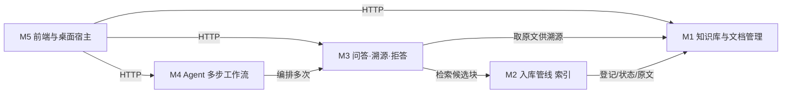
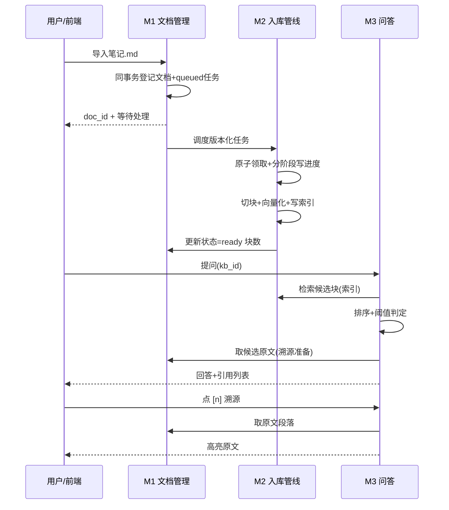

# 02-模块拆分与业务边界（v0.8）

| 字段 | 内容 |
|---|---|
| 状态 | 已实现（持续维护） |
| 版本 | v0.8 |
| 日期 | 2026-09-25 |
| 上游 | `01-requirements.md`（PRD v0.5：决策 D1–D7 全部拍板） |
| 变更 | v0.8：把可恢复任务拆为 domain/repository/service，并明确版本化领取与启动恢复边界；v0.7：拆出不读取业务正文的诊断基础设施；v0.6：明确桌面宿主只管理进程/窗口生命周期；v0.5：明确 Vault 外部来源观察与共享索引构建边界 |

> 本文回答：功能切成哪几个模块、每个模块职责边界划在哪、依赖朝哪个方向走。
> 每个模块对应一张 `templates/module-design.md`（= 一个 GitHub 子 Issue 与若干 PR）。

## 1. 划分判据（为什么这样切）

四个判据，按优先级排列：

1. **对外 API 边界优先**：模块 = 一组对外可独立调用的服务边界。反例是早期草案把「溯源」「拒答」单列——它们没有独立 API 的价值，只是问答响应内部的构成，单列会让一次问答横跨三个模块。
2. **依赖必须无环**：模块间只能有一个方向的引用流。无环是「边界讲得清」的最低要求。
3. **变更频率聚类**：处理策略（切分/向量）和问答策略（检索/生成）是两套独立调参面，拆开才能单独测试与评估（直接服务 06-评估）。
4. **产品演进不破界**：演进路线（01 §2.3）里每一项都能落到某个模块内增长，而不是新增横向依赖（如 V1.0 的 PDF 解析长在 M2 内部）。

## 2. 模块总览

| 模块 | 名称 | 一句话职责 | 关键故事 | 计划窗口 |
|---|---|---|---|---|
| M1 | 知识库与文档管理 | 管「有哪些库/文档、原文存哪、处理状态如何」 | US-M1-01~06 | 9 月 |
| M2 | 入库管线 | 文档 → 切块 → 向量 → 索引；任务状态机（处理中/就绪/失败） | （M1 触发） | 10 月上 |
| M3 | 问答·溯源·拒答 | 库内提问 → 检索 → 带引用回答；答不上明示；引用可核对 | US-M3-01~05 | 10 月 |
| M4 | Agent 多步工作流 | 综合任务拆步执行，逐步可查、缺料可见 | US-M4-01/02 | 11 月 |
| M5 | 前端与桌面宿主 | 全流程可用界面；本地宿主只管理窗口和服务生命周期 | 全部 | 12 月 |

> 图注：依赖自右向左读——M5 只消费 M1/M3/M4 的 HTTP API；M4 编排 M3；
> M3 检索 M2 的索引、经 M1 取原文溯源；M2 读写 M1 的文档登记与状态。
> M3 内带会话状态（决策 D5）：同会话追问携带上文重检索，是 M3 内部职责，不引入新模块。

## 3. 模块边界

### M1 知识库与文档管理

- **属于**：知识库 CRUD 与级联删除编排；文档导入接口（登记即返回）、列表/查看/删除/重传；上传格式与 ZIP 安全校验；原文、图片包清单和原图的版本化存储；Vault 来源观察与外部文件身份校验；文档处理状态对外暴露（pending/processing/ready/failed）。
- **不属于**：切分、向量化、索引写入（M2 的动作，M1 只持有结果状态与统计）。
- **边界规则**：M1 保证「元数据、原文、原图、状态正确可读」，不保证「可检索」——可检索由 M2 的处理回报保证。`document_io` 只产出经过校验的不可变值对象，`package_storage` 只负责版本清单和字节完整性，`app.vault` 管理重建清单、事务编排和已登记来源观察，HTTP 内容读取独立放在 `routers/document_content.py`。上传接口只登记与触发，不在请求内等待处理完成（D3）。
- **库删除**：M1 编排三步——删文档元数据 → 删原文文件 → 调 M2 清理该库全部块与向量；任一步失败回滚为「库标记删除中」，不允许半删状态对外可见。

### M2 入库管线

- **属于**：文本解析与切块策略（Markdown 结构感知，图片语法区间不可切断）；逐块向量化；块/索引写入与清理（重传=全量重建、外部编辑=单文档重建、删库=级联清理）；任务执行与状态机维护（幂等：同文档重传不产生重复块）。
- **不属于**：上传接口与文件存储（M1）；检索与问答（M3）。
- **边界规则**：HTTP 上传在文档登记事务内创建当前版本任务，再把不可变 `IngestTaskSpec` 交给后台执行；清理由数据库级联和 M1 文件编排完成。切分与向量校验收敛在 `app.document_index`，供普通入库、数据库重建和外部编辑同步复用。M2 不感知 HTTP 与用户（异步承载 D4 是它的实现细节，与边界无关）。
- **任务拆包**：`app.ingest_tasks.domain` 只定义身份与状态，`repository` 只做带 `doc_id + ingest_version + candidate_path` 条件的原子领取/阶段更新，`service` 只编排执行和启动恢复。一个文档只保留当前任务行；重传覆盖任务身份，旧执行者的阶段和终态更新自然失效。
- **恢复顺序**：启动先完成 Vault/SQLite 外部来源对账，再扫描任务和 `pending / processing` 文档。文档已发布而任务尚未终结时只补齐终态；确实未完成时顺序续跑，单篇普通失败不阻断后续文档，一致性故障则停止启动。
- **启动同步拆包**：`app.vault.external_sync` 只编排状态，`external_source` 只负责稳定读取和变化判定，`external_index` 只负责 Vault 领先与 SQLite 单文档事务发布；三层都复用 M2 的 `document_index`，不复制切分和向量校验规则。
- **独立成模块的理由**：切分/向量是全项目最大的调参面（10 月调优、11 月评估都直接对着它），独立才能单测与量化比较。

### M3 问答·溯源·拒答

- **属于**：问题与库范围校验；混合检索（向量+关键词）触发；候选排序与相关度阈值判定；LLM 生成带 `[n]` 标注的回答；置信自检与拒答文案；引用 → 原文段落跳转查询；会话上下文（D5：同会话追问携带上文重检索，进程内存、不落库）。
- **不属于**：任务拆解与跨步调度（M4）；切分向量化（M2）；问答历史持久化（演进 V1.0，01 §2.3）。
- **边界规则**：检索范围由请求显式携带（`kb_id` 或 all），不做自动猜库；拒答是正常业务结果——HTTP 200 + 结构化标记，不是错误响应（US-M3-04）。
- **会话与拒答的关系**：追问时检索范围与阈值判定同上文一致，会话只提供上文重检索，不改变判定规则——防止会话悄悄变成第二个检索通道。

### M4 Agent 多步工作流

- **属于**：综合任务目标拆解（规划）；子步骤循环调度；每步缺料记录；跨步汇总与最终结构化输出；执行进度对用户可见（步骤清单 + 当前步骤）。
- **不属于**：单步检索与生成细节（复用 M3）；任务持久化与断点恢复（MVP 同步执行，异步长任务留 V1.0+）。
- **边界规则**：M4 不直接检索、不直接调 LLM 生成——只把子问题交给 M3 的问答能力并汇总其结果。这是「编排者」与「第二个 RAG」的分界线。

### M5 前端与桌面宿主

- **属于**：库/文档管理页（含真实入库阶段、图片数与重传入口）；问答页（库选择、引用点击 → 原文及原图核对、拒答呈现）；综合任务页（步骤进度展示）；导入失败提示；复制诊断摘要；本机单实例、窗口、本地 API 启停和系统 WebView profile 生命周期。
- **不属于**：任何业务判定（排序/阈值/拒答/溯源拼接都在后端，前端只渲染契约对象）；桌面壳也不直接访问 ORM、Vault 或模型服务。
- **边界规则**：TypeScript 界面只消费 REST 契约；后端 OpenAPI 可独立走通全流程（答辩与联调双通道）。源码内部按 `api / state / conversations / navigation / library / tasks / graph / evidence` 拆分，`main.ts` 只负责装配；FastAPI 只托管 Vite 的 `dist` 产物，不读取源码模块。
- **桌面宿主拆包**：`app.desktop.instance_lock` 只负责操作系统单实例锁，`app.desktop.server` 只负责回环 Uvicorn 的就绪与退出，`app.desktop.launcher` 只编排运行时和 pywebview 主线程。宿主把 `/ui/` 当作不透明页面，不复制 API 客户端或业务状态；未来替换为 Tauri 时仍保留同一 REST 边界。

### 横切诊断基础设施

- **属于**：SQLite 日常运行的滚动文件日志；请求 ID 与总耗时；模型、检索、工作流和索引阶段耗时；固定 500 文案；不含知识正文的诊断摘要。
- **不属于**：业务状态、问答历史、任务持久化、用户行为分析或远程遥测。诊断模块不读取请求/响应正文，也不上传任何信息。
- **边界规则**：`app.diagnostics.context` 只传播请求 ID，`middleware` 只观察 HTTP 元数据，`stages` 只接受代码传入的 ID/计数，`local_logging` 只处理落盘/轮转/脱敏，`report` 以显式允许字段组装摘要。业务模块可以调用 `timed_stage`，不能反向依赖日志文件或诊断路由。

## 4. 业务归属速查表

评审/自检时「这块逻辑放哪」的标准答案：

| 业务问题 | 归属 | 一句话理由 |
|---|---|---|
| 上传的文件存哪、库里有几篇文档 | M1 | 元数据与原文的家 |
| 文档为什么还在「处理中」 | M1（状态查询）+ M2（任务写入/恢复） | 文档状态表达可用性，任务阶段表达当前工序 |
| 文档被切成几块、向量怎么算 | M2 | 可检索化的准备工序 |
| 提问命中哪些块、分数够不够 | M3 | 检索与判定的唯一入口 |
| 引用 [2] 对应原文哪一段 | M3（定位）→ M1（原文） | 溯源经 M1 取原文，判定归 M3 |
| 「答不出」算不算报错 | M3 | 拒答 = 正常响应 200 + 标记 |
| 任务先做哪步、哪步缺料 | M4 | 只编排不造检索 |
| 界面按钮点了发什么请求 | M5 | 只渲染不思考 |
| 双击、关窗和重复启动由谁处理 | M5（桌面宿主） | 只管理本机生命周期，不进入业务模块 |
| 卡在模型、检索还是索引怎么判断 | 横切诊断基础设施 | 只记录请求 ID、阶段、耗时和机器字段，不读取业务正文 |
| 追问要不要带上一句 | M3（会话，D5） | 会话是 M3 内部状态，不是新模块 |

## 5. 跨模块协作时序（主链路走查）

> 图注：一次完整旅程的时序——导入登记与异步处理（M1/M2）、提问与溯源（M3 经 M2 索引 + M1 原文）。
> 用于答辩讲「模块协作」与联调排障。

## 6. 开发顺序与 PR 规划

每个模块先填 `templates/module-design.md` 转子 Issue，再开发；PR 粒度 = 模板验收清单可独立合入的单位。

| 顺序 | 模块 | 依赖前置 | 交付标志 |
|---|---|---|---|
| 1 | M1 | `03-data-model` 定稿 | 库/文档 CRUD + 状态流转（Swagger 验证） |
| 2 | M2 | M1 | 样例笔记处理完成，块与向量可查、失败可重传 |
| 3 | M3 | M2 | 问答带引用、域外拒答、引用可溯源 |
| 4 | M4 | M3 | 综合任务跑通，缺料步骤可见 |
| 5 | M5 | M1/M3/M4 | 浏览器端全流程演示 |
