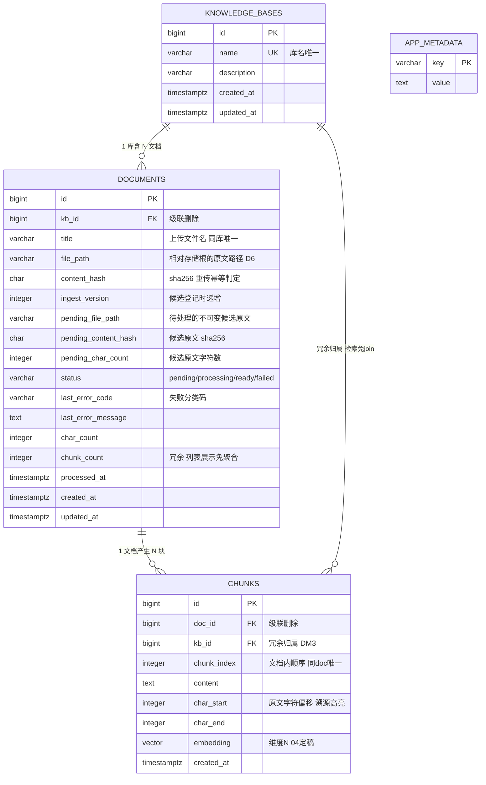
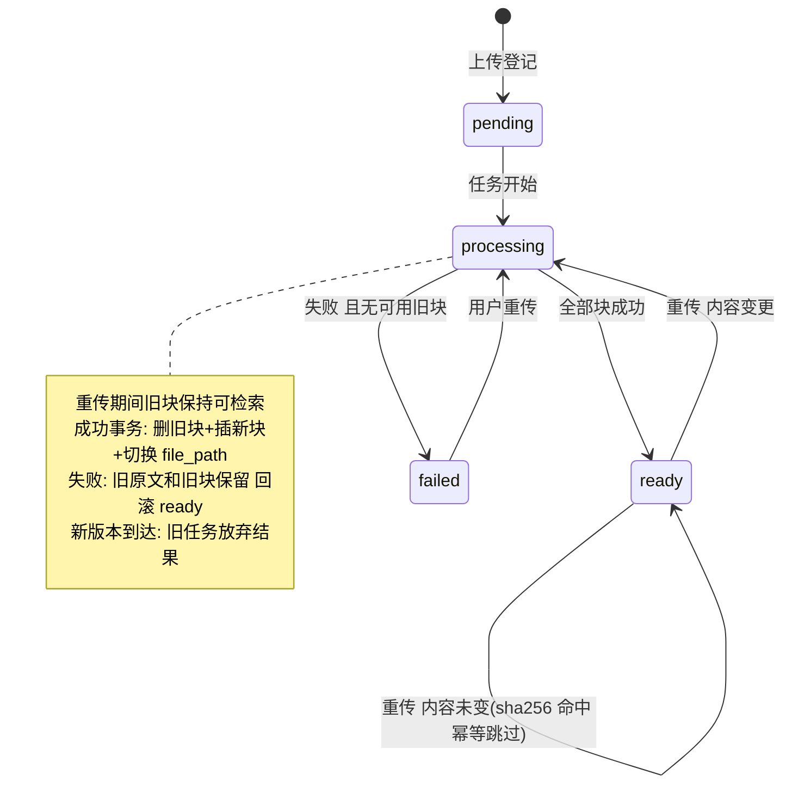

# 03-数据模型（v0.7）

| 字段 | 内容 |
|---|---|
| 状态 | 已实现 |
| 版本 | v0.7 |
| 日期 | 2026-09-22 |
| 上游 | `01-requirements.md`（PRD v0.5，决策 D1–D7）· `02-modules.md`（v0.5，模块边界） |
| 变更 | v0.7：定义外部编辑时 Vault 领先、SQLite 可续接的提交语义；v0.6：增加文件系统 Vault 清单与 SQLite 可重建边界 |
| 关联 | M1/M2 子 Issue（建仓后建立） |

> 本文回答：需求落成哪几张表、字段与约束怎么定、存储与索引选型、如何映射到 SQLAlchemy。
> 本文不写：检索算法与切分策略（`04-retrieval.md`）、API 契约（模块开发时填模板）。

## 1. 设计依据

### 1.1 表 ↔ 模块 ↔ 决策映射

| 表 | 概念归属 | 支撑的决策/故事 |
|---|---|---|
| `knowledge_bases` | M1 | D2 多知识库；US-M1-01 |
| `documents` | M1（M2 写状态字段） | D2/D3/D6；US-M1-02~06 |
| `chunks` | M2 产物 | D3 全量重建；US-M3-03 溯源 |
| `app_metadata` | 基础设施 | SQLite schema 版本；embedding 服务/模型/维度指纹 |
| `.knowbase-vault.json` | 文件系统基础设施 | 稳定业务元数据与原文校验；SQLite 丢失后的重建输入；外部编辑同步的提交真相 |
| （无会话表） | M3 | D5：会话仅进程内存，V1.0 持久化时再增量建表，不预建 |

### 1.2 三条建模原则

1. **表服务于已拍板的语义，不为"将来可能用"建表**：会话持久化（V1.0）不预建表，演进时增量加。
2. **用户输入永不直接进文件路径**：原文文件名一律用 `doc_id`（防路径注入与重名），用户文件名只存 `title` 字段。
3. **导入绝不破坏可用性**：重传写入不可变候选原文，处理期间旧原文和旧块保持匹配，成功才在数据库事务中统一切换（细节见 §4 状态机）。

## 2. ER 图

> 图注：一张库含多篇文档，一篇文档产生多块；chunks 冗余持有 kb_id——
> 检索层按库过滤免 join documents（代价与理由见 DM3）。



## 3. 表设计（DDL 草案）

> 当前 `embedding` 维度为 1024（04 §8 DR2，BAAI/bge-m3）；
> HNSW 向量索引（cosine）随首个迁移版本与列一同落库。

```sql
-- 知识库：多库隔离的根实体（D2）
CREATE TABLE knowledge_bases (
    id          bigint GENERATED ALWAYS AS IDENTITY PRIMARY KEY,
    name        varchar(100) NOT NULL UNIQUE,     -- 库名唯一：防同名混淆
    description varchar(500),
    created_at  timestamptz NOT NULL DEFAULT now(),
    updated_at  timestamptz NOT NULL DEFAULT now()
);

-- 文档：元数据 + 原文路径（D6 原文在文件系统，库内不存正文）
CREATE TABLE documents (
    id            bigint GENERATED ALWAYS AS IDENTITY PRIMARY KEY,
    kb_id         bigint NOT NULL REFERENCES knowledge_bases(id) ON DELETE CASCADE,
    title         varchar(255) NOT NULL,          -- 上传文件名（仅存元数据，不进路径）
    file_path     varchar(500) NOT NULL,          -- 当前可用原文；必须与现有 chunks 匹配
    content_hash  varchar(64) NOT NULL,           -- 当前可用原文 sha256
    ingest_version integer NOT NULL DEFAULT 1,    -- 候选登记的单调版本，旧任务提交前核对
    pending_file_path varchar(500),               -- 待处理的不可变候选原文
    pending_content_hash varchar(64),              -- 候选原文 sha256
    pending_char_count integer,                    -- 候选原文字符数
    status        varchar(16) NOT NULL DEFAULT 'pending'
                  CHECK (status IN ('pending','processing','ready','failed')),
    last_error_code    varchar(32),               -- UNSUPPORTED_FORMAT/EMPTY_CONTENT/TOO_LARGE/PARSE_FAILED/EMBED_FAILED
    last_error_message text,                      -- 人类可读原因（US-M1-06）
    char_count    integer NOT NULL DEFAULT 0,     -- 原文字符数（按字符，非字节）
    chunk_count   integer NOT NULL DEFAULT 0,     -- 冗余：列表展示免聚合；M2 维护（见 DM 说明）
    processed_at  timestamptz,                    -- 最近一次处理落定时间
    created_at    timestamptz NOT NULL DEFAULT now(),
    updated_at    timestamptz NOT NULL DEFAULT now(),
    UNIQUE (kb_id, title)                         -- 同库同文件名 = 重传对象（US-M1-04 语义落点）
);
CREATE INDEX idx_documents_kb ON documents (kb_id);

-- 切块：检索单元 + 溯源锚点（M2 的唯一产物表）
CREATE TABLE chunks (
    id          bigint GENERATED ALWAYS AS IDENTITY PRIMARY KEY,
    doc_id      bigint NOT NULL REFERENCES documents(id) ON DELETE CASCADE,
    kb_id       bigint NOT NULL REFERENCES knowledge_bases(id) ON DELETE CASCADE,
    chunk_index integer NOT NULL,                 -- 文档内顺序，跨文档重建时全删全插
    content     text NOT NULL,
    char_start  integer NOT NULL,                 -- 原文内字符区间 [start,end)：溯源跳转高亮用
    char_end    integer NOT NULL,
    embedding   vector(1024) NOT NULL,            -- 当前默认 BAAI/bge-m3（04 §8 DR2）
    created_at  timestamptz NOT NULL DEFAULT now(),
    UNIQUE (doc_id, chunk_index)
);
CREATE INDEX idx_chunks_doc ON chunks (doc_id);
-- 向量索引（HNSW / cosine）待 04 定稿 embedding 模型后随迁移创建

CREATE TABLE app_metadata (
    key   varchar(100) PRIMARY KEY,
    value text NOT NULL
);
```

`app_metadata` 不存用户内容。PostgreSQL 由 Alembic 建表；SQLite 还用其中的
`schema_version` 驱动桌面数据库升级。`embedding_profile_v1` 保存规范化的服务地址、
模型和维度，并对 JSON 取 SHA-256 作为诊断指纹。有现有块时不允许直接改写该值。

SQLite 方言把 bigint 主键映射为 `INTEGER PRIMARY KEY`，把 `vector(1024)` 映射为 JSON
数组；FTS5 虚拟表与触发器由 schema 初始化器维护，不进入 ORM 实体。PostgreSQL 仍保留
BIGINT、pgvector、HNSW 与 GIN，双方言差异不进入业务表模型。

### 原文文件目录约定（D6）

```text
storage/                      # 根路径可配置（如 ./data/storage）
├── .knowbase-vault.json     # 版本化、带 payload SHA-256 的原子清单
└── {kb_id}/
    ├── {doc_id}.md           # 迁移前的活动原文仍可读取
    └── {doc_id}/
        ├── v{version}-{hash}.md  # 普通文本的不可变原文版本
        └── v{version}-{hash16}/  # Markdown 图片包的不可变版本目录
            ├── source.md         # 原始 UTF-8 Markdown 字节
            ├── manifest.json     # 归属、摘要、图片元数据与出现字符区间
            └── assets/
                └── {sha256}.{ext} # 去重后的原始图片字节
```

图片包清单不另建数据库表：它与不可变文件版本同生共灭，可从目录整体校验。重传成功后，普通文本旧候选会清理；历史图片包保留到文档删除，使已经保存的回答引用仍能打开当时的原图。删文档会删除该文档所有版本，删库会删除整个 `{kb_id}/` 目录。

Vault 清单记录知识库/文档 ID、标题与活动/候选原文元数据，不记录 chunks、向量或密钥。日常 SQLite 业务写入先原子更新清单，再提交数据库；提交失败后按回滚结果补偿清单。数据库级联与物理文件删除仍不是同一事务：清单和数据库确认删除后再清理目录，文件删除失败只留下无引用孤儿，不反向恢复已经删除的业务记录。编排由 `app.vault.coordinator` 与 M1 共同负责。

外部普通文本已经由用户保存到原路径时，文件字节本身是最新真相，不能在 SQLite 提交失败后把 Vault 补偿回旧摘要。启动同步因此先写入包含新 `SourceRecord` 与单调 `ingest_version` 的 Vault，再事务化替换该文档的 chunk 与索引；两步之间中断时允许 SQLite 暂时落后一个已解释版本，下一次启动从 Vault 重做派生索引。除此之外的版本倒退、候选状态冲突或身份元数据差异仍视为不可解释状态并停止启动。

## 4. 文档状态机

> 图注：pending=已登记待处理；failed 的语义是「当前无任何可用内容」——
> 重传失败时若旧块仍有效则回滚为 ready 并记录 last_error；候选原文不会提前替换活动原文。



## 5. SQLAlchemy 映射骨架（2.x 声明式）

> 与 §3 DDL 一一对应，是 `app/models.py` 的底稿（M1 骨架阶段落成完整版）。
> 教学注：`mapped_column` 是 2.x 的声明写法，`server_default` 让默认值由数据库生成而非应用。
> **工程实现注记（2026-09-07，防照抄踩坑）**：
> ① `Base` 实际由 `app/db.py` 提供（engine/session/Base 同文件），models.py 应 `from app.db import Base`——
>    重复定义 Base 会产生两个 metadata，Alembic 迁移发现不了表；
> ② 本骨架含 Chunk 仅为完整参照——**M1 迁移只建 knowledge_bases + documents 两表**，
>    Chunk 模型与 embedding 列随 M2 里程碑引入（模块 PR 粒度原则）；
> ③ 勿漏 `updated_at`（两表均有）、documents 的 `last_error_message`/`processed_at`/`chunk_count`（对照 §3 DDL 逐字段检查）。

```python
from datetime import datetime
from sqlalchemy import BigInteger, CheckConstraint, ForeignKey, Identity, String, Text, UniqueConstraint, func
from sqlalchemy.orm import DeclarativeBase, Mapped, mapped_column, relationship

class Base(DeclarativeBase):
    pass

class KnowledgeBase(Base):
    __tablename__ = "knowledge_bases"
    id: Mapped[int] = mapped_column(BigInteger, Identity(), primary_key=True)
    name: Mapped[str] = mapped_column(String(100), unique=True)
    description: Mapped[str | None] = mapped_column(String(500))
    created_at: Mapped[datetime] = mapped_column(server_default=func.now())
    documents: Mapped[list["Document"]] = relationship(back_populates="kb")

class Document(Base):
    __tablename__ = "documents"
    __table_args__ = (
        UniqueConstraint("kb_id", "title"),
        CheckConstraint("status IN ('pending','processing','ready','failed')",
                        name="ck_documents_status"),
    )
    id: Mapped[int] = mapped_column(BigInteger, Identity(), primary_key=True)
    kb_id: Mapped[int] = mapped_column(ForeignKey("knowledge_bases.id", ondelete="CASCADE"))
    title: Mapped[str] = mapped_column(String(255))
    file_path: Mapped[str] = mapped_column(String(500))
    content_hash: Mapped[str] = mapped_column(String(64))
    ingest_version: Mapped[int] = mapped_column(default=1, server_default="1")
    pending_file_path: Mapped[str | None] = mapped_column(String(500))
    pending_content_hash: Mapped[str | None] = mapped_column(String(64))
    pending_char_count: Mapped[int | None]
    status: Mapped[str] = mapped_column(String(16), default="pending",
        server_default="pending")
    last_error_code: Mapped[str | None] = mapped_column(String(32))
    char_count: Mapped[int] = mapped_column(default=0, server_default="0")
    kb: Mapped[KnowledgeBase] = relationship(back_populates="documents")
    chunks: Mapped[list["Chunk"]] = relationship(
        back_populates="doc", cascade="all, delete-orphan")

class Chunk(Base):
    __tablename__ = "chunks"
    id: Mapped[int] = mapped_column(BigInteger, Identity(), primary_key=True)
    doc_id: Mapped[int] = mapped_column(ForeignKey("documents.id", ondelete="CASCADE"))
    kb_id: Mapped[int] = mapped_column(ForeignKey("knowledge_bases.id", ondelete="CASCADE"))
    chunk_index: Mapped[int]
    content: Mapped[str] = mapped_column(Text)
    char_start: Mapped[int]
    char_end: Mapped[int]
    doc: Mapped[Document] = relationship(back_populates="chunks")
```

## 6. 决策记录（2026-09-06 拍板）

| 编号 | 决策（已拍板） | 备选与代价 | 理由 |
|---|---|---|---|
| DM1 | 主键 `bigint IDENTITY` | UUID：分布式/防枚举，URL 冗长 | 单用户自托管无分布式需求；自增可读、索引紧凑 |
| DM2 | 向量存储 pgvector（HNSW/cosine） | 独立向量库（Qdrant/Chroma）：多一套部署与同步；FAISS 文件：无事务 | 单库单事务：向量与元数据一致备份；部署只多一个扩展 |
| DM3 | chunks 冗余 `kb_id` | 不冗余：检索每次 join documents | 高频的按库过滤免 join；删除由 FK 级联兜底。代价：V1.0 支持跨库移动文档时需级联更新冗余列（已记录演进条件） |
| DM4 | 重传语义 = `UNIQUE(kb_id,title)` + sha256 + 文档内单调 `ingest_version` | 独立版本表：保留完整历史，但当前产品只需要活动版和单个候选版 | 同库同名即重传对象；版本与候选路径共同阻止旧任务覆盖新内容 |
| DM5 | 导入失败保旧：不可变候选原文处理成功后才切换；无旧块→failed，有旧块→ready + `last_error` | 直接覆盖活动文件：失败时旧块偏移与新原文错位 | 原文、字符偏移和块始终属于同一版本 |
| DM6 | 状态承载 `varchar` + CHECK | PG 原生 enum：演进枚举值需迁移 | 改枚举值免数据库迁移；SQLAlchemy 侧同字段字符串语义简单 |

## 7. 移交 04 的待定清单（不影响本层表结构的主体）

| 待定项 | 影响 |
|---|---|
| ~~Embedding 模型与维度 N~~ | **当前默认**：1024 / BAAI/bge-m3（04 §8 DR2）；更换模型需要迁移与全库重建 |
| 关键词检索承载 | 已定 pg_trgm（04 DR4）→ **无需新增 tsvector 列**；若未来升级 zhparser 再做迁移 |
| 检索阈值 / top-k | 纯参数，无新列 |
| 切分策略粒度 | 决定 chunk 实际大小分布，无新列 |

## 8. 下一步衔接

- 本层决策已全部拍板；根 README 技术栈同步：pgvector 由"评估中"转"已定"。
- M1 骨架开发前填写 `templates/module-design.md`：数据原型节直接引用本文 DDL 的 `knowledge_bases`/`documents`；本文件 DDL 草案是首个 Alembic 迁移的底稿（`embedding` 维度经 04 确认后落库）。
