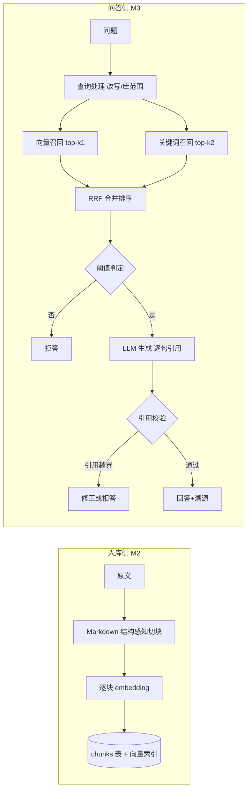

# 04-检索链路设计（v0.6）

| 字段 | 内容 |
|---|---|
| 状态 | 已实现（本层决策 DR1–DR6 已拍板） |
| 版本 | v0.6 |
| 日期 | 2026-09-25 |
| 上游 | `01-requirements.md`（PRD v0.5）· `02-modules.md`（v0.4）· `03-data-model.md`（v0.4，DDL 使用 `chunks.embedding vector(1024)`） |
| 变更 | v0.6：加入生成前快照、POST SSE 增量与 L2 最终发布时序；v0.5：加入 Markdown 图片语法保护区及图片不参与向量化的边界；v0.4：默认 embedding 迁移为 BAAI/bge-m3 / 1024 维 |
| 关联 | M2/M3 子 Issue（建仓后建立） |

> 本文回答检索链路四个问题：**怎么切、怎么向量化、怎么召回、怎么判定**。
> 本文不写：回答生成的 prompt 细节（M3 模块设计时填）、评估方法（`06-evaluation.md`）。

## 1. 链路全景

> 图注：链路分入库侧（一次性，M2）与问答侧（每次请求，M3）。问答侧四站——
> 查询处理 → 双通道召回 → 合并排序 → 阈值判定；引用校验发生在生成之后，是防幻觉的最后一道闸。

## 2. 切分策略（入库侧）

**目标**：块是检索与溯源的原子单元——块太小丢上下文、太大稀释语义，切分错误无法靠检索补救。

**方法**：Markdown 结构感知切块（DR1）：

1. 按标题层级（`#`→`##`→…）确定候选边界，保持标题与正文同块（标题是块的"语义标签"，检索命中标题块时内容才可读）。
2. 块尺寸目标 **≈512 token**（中英文混合按字符估算：中文 ≈1.5 字/token 量级，实现时以字符计数 + 上限兜底），超限时按段落边界二次拆分。
3. 相邻块重叠 **~10%**（防标题/结论恰好落在边界被截断）。
4. 无标题纯文本（.txt）：按空行分段、定长窗口 + 重叠兜底。
5. 记录每块的 `char_start/char_end`（03 溯源锚点）——切分策略调参只改块边界，锚点机制不变。
6. 超长段落的窗口在换行处回缩后，下一窗口按**实际结束位置**减去重叠前进，并保证每轮取得进展；回归测试验证窗口区间覆盖原段落，不能因回缩丢失字符。
7. Markdown 图片语法的 `[char_start, char_end)` 是保护区间，标题边界、窗口末尾与重叠起点均不得落在区间内部；保护区间超过块上限时允许该块临时超限，且下一个块必须扩展已覆盖范围，避免重复块。图片字节不进入 embedding，alt 文本和周边正文照常参与检索。

**调参权**：切分参数是本项目最大的调参面，所有参数以 06 评估结果为准回调，不在文档里拍死。

切分修复不会自动更新已有块；旧文档需重新解析和生成向量，同内容重传可能因 hash 幂等而跳过，维护方法见 [运行与维护 §3](../operations.md#3-切块修复与已有知识库)。

## 3. Embedding 通道（入库侧）

| 约束 | 结论 |
|---|---|
| 中文为主的课程笔记 | 需中文能力强的 embedding 模型 |
| 无 lab 服务器（当前） | 云 API；接口按 OpenAI 兼容协议抽象，供应商可配（D2 的 provider 边界） |
| 当前 DDL 已落 `vector(1024)` | 默认模型固定 1024 维，换模型需迁移（写进 DR2 代价） |

- **当前默认**：SiliconFlow 的 OpenAI 兼容 embedding（`BAAI/bge-m3`，1024 维，中文能力强）。
- **供应商切换**：provider 接口保持 OpenAI 兼容；切换模型时必须同步配置并执行一次向量维度迁移。
- **请求边界**：入库按 `EMBEDDING_BATCH_SIZE` 分批；单批遇到限流、5xx 或传输故障时指数退避重试，已成功批次不重复请求。HTTP 200 仍需校验 JSON 结构、数量、index、数值有效性和向量维度。
- **实现边界**：embedding 调用归 M2（入库）与 M3（查询向量化共用同一 provider 服务），模型不一致会导致向量空间错位——**全项目 embedding 模型必须唯一**（写入 DR2 边界规则）。

## 4. 混合检索与合并（问答侧）

### 4.1 为什么需要关键词通道

向量检索擅长语义近似，但**精确词面**（术语缩写、函数名、编号、公式）召回弱：问"select 和 poll 的区别"，向量可能召回"epoll 原理"，词面通道能锁定字面命中。中文场景关键词通道的另一价值：罕见专名（人名/课程名缩写）的精确锚定。

### 4.2 双通道设计（DR3）

| 通道 | 承载 | 召回量 |
|---|---|---|
| 向量 | pgvector cosine（HNSW 索引），`kb_id` 过滤 | top-k1 = 20 |
| 关键词 | PostgreSQL `pg_trgm` 相似度（内置扩展，零部署），`kb_id` 过滤 | top-k2 = 10 |

- 关键词来源：实际检索问题（追问时为改写后的问题），当前没有单独的 LLM 关键词抽取调用。
- 关键词 SQL 使用 `content % :query` 预过滤，再按 `similarity(content, :query)` 排序；以事务局部配置设置相似度阈值（默认 0.1）。`%` 可使用 `gin_trgm_ops`，具体计划仍取决于数据量与选择性，见 [PostgreSQL pg_trgm 索引支持](https://www.postgresql.org/docs/16/pgtrgm.html#PGTRGM-INDEX)。
- **合并：RRF（Reciprocal Rank Fusion）**——按排名倒数的倒数求和，不依赖两个通道的分数尺度可比性（向量余弦与 trigram 相似度量纲不同，加权求和需标定权重，RRF 免标定，是业界通用 baseline）。

### 4.3 中文分词的取舍（DR4）

PostgreSQL 原生 FTS（tsvector）对无空格中文无效，需 `zhparser`/`pg_jieba` 等扩展（涉及镜像编译/维护）。MVP 决策：

- 关键词通道用 `pg_trgm`（随 PG 自带，`CREATE EXTENSION` 即用）。
- 已知局限：trigram 对 2 字词匹配弱——由向量通道互补；若 06 评估显示关键词通道贡献低于预期，**降级为纯向量 + 简单词面过滤**，不引入外部引擎。
- 升级条件（记录在案）：评估显示词面召回是主要漏检源时，评估引入 `zhparser`（docker 镜像方案）的收益再动。

## 5. 溯源与防幻觉（问答侧）

回答必须可溯源是产品第一原则（01 §1.2），机制分三层：

1. **生成约束**：prompt 三重声明——① 只基于提供的块作答，未提供的知识一律不答；
   ② 引用标注 `[n]` 对应块序号；③ **先给结论、再用资料里的机制/步骤/条件展开解释**，
   资料写到几个要点就展开几点。
   > 第 ③ 条是 2026-09-10 修订：只要求引用、不要求解释时，模型会给出「一句话结论 + 一串引用」
   > （实测："TCP 三次握手是为了确认双方的发送与接收能力都正常 [1][2][3][4]"），
   > 用户读不到逻辑依据。要求展开后，同一问题会给出"第一/二次握手确认什么 → 为何不够 →
   > 第三次解决什么"的分层解释，且引用仍逐句可核对。
2. **引用校验（生成后强制检查）**：解析回答中的每个 `[n]`，断言 `n` 存在于本次提供的块列表——**越界引用 = 幻觉引用**，该句降级处理（去引用重生成 / 整答拒答）。此检查是纯规则，零成本、必执行。
3. **溯源呈现**：回答携带 citation 列表（块 id → 03 的 `char_start/end`），前端据此跳转高亮。

## 6. 拒答判定（问答侧）

两级判定，与 01 §4.2 流程一致：

| 级 | 时机 | 机制 | 参数 |
|---|---|---|---|
| L1 | 召回合并后 | 候选块最高**向量相似度**低于阈值 τ → 拒答 | **τ=0.50**（06 的 v2 多库评估校准） |
| L2 | 生成后 | 引用越界校验（纯规则）+ 零引用拒答 + 模型自述"资料不足"归入低相关 | 规则，无参数 |

**设计要点**：检索分数分布随库内容漂移，绝对阈值不可靠——τ 只是护栏（宁严勿松，产品原则"可信优先"）。
**校准结果（06 §6，2026-09-20 v2 实测）**：5 个库、60 条样本中，库内问题最高
相似度范围约为 0.543–0.807，库外约为 0.332–0.493。τ=0.45 只能拦截
60% 的库外样本；τ=0.50 时库外拒答率 100%、库内误拒率 0%，τ=0.55 已产生 2%
库内误拒。因此默认值取 **0.50**。该值只适用于当前模型与检索实现，换模型或后端后
必须重新扫描。

**L1 与 L2 的分工**：L1 是便宜的前置护栏，L2 是生成后的兜底——两者都要有，
但**能用 L1 拦下的不应留给 L2**（L2 依赖模型"诚实自述"，不如规则稳定）。

### 6.1 流式传输与最终发布

界面使用 `POST /api/v1/ask/stream`，因为问题、库范围和历史都在请求体中；服务端响应为
`text/event-stream`，事件顺序固定为：

1. `metadata`：数据库阶段已结束，返回实际检索语句；此时检索候选和引用已经复制为普通数据，事务已回滚。
2. `delta`：供应商产生的文本增量。它是**待 L2 校验草稿**，前端明确标注状态，引用编号暂不绑定原文。
3. `result`：完整文本经过引用越界、零引用和资料不足规则后形成的最终 `AnswerOut`；只有此事件写入会话并启用引用交互。

L1 在任何模型正文发送前完成；空库、低相关、Embedding 不可用或模型指纹不一致只产生
`metadata + result`，不会产生 `delta`。供应商在流中失败时，已显示草稿由最终
`llm_unavailable` 拒答替换。未处理异常则发送不含内部细节、带 request ID 的 `error` 事件，
且不写会话。兼容脚本仍可使用同步 `/api/v1/ask`，两条路径共用同一个准备与 L2 校验实现。

## 7. 会话追问与查询改写（问答侧）

D5 已拍板会话入 MVP。追问（"那拥塞窗口怎么调？"）是**指代句**，直接拿去检索会错过上文主题词：

- **DR5 决策**：追问进入检索前，先由 LLM 改写为**自包含问题**（"TCP 拥塞窗口怎么调整？"）再走双通道检索；改写调用与回答同会话上文，成本 = 每次追问 1 次轻量调用。
- 边界：改写失败（LLM 不可用）时退化——用本次原问题检索，保证链路可用性不因增强件而断。

### 7.1 上下文来源：前端持久化 + 请求携带（2026-09-10 修订）

会话上下文有两条来源，**请求体携带的 `history` 优先**：

| 来源 | 机制 | 存活范围 |
|---|---|---|
| `history`（首选） | 前端把会话存在浏览器本地（localStorage），每次追问把最近 6 轮随请求回传 | 跨刷新、跨服务重启（存在用户设备上） |
| `session_id`（兼容） | 服务端进程内会话（D5 原方案，TTL 30 分钟） | 进程生命周期 |

**为什么改成请求携带**：D5 定的"进程内存、不落库"在体验上有硬伤——刷新页面即丢上下文，
用户会看到"追问改写在刷新后失效"。改为前端持有后：

- 当前界面的追问上下文不依赖服务端会话存活（兼容 `session_id` 路径仍有进程状态，不引入会话表）；
- 上下文随用户设备走，刷新/重启都不丢；
- 代价：每轮多传最多 6 轮对话（约数百 token），且**历史由客户端提供**——
  因此它只用于「改写检索用语」这一处，不参与拒答判定与引用校验（防篡改面收敛到最小）。

**保存与停止（前端交互，M5）**：会话列表存 localStorage（新建/切换/删除）；
请求进行中可点「停止」中断等待（AbortController），被停止的问题不入会话记录。
停止不会取消服务端同步模型调用；30 分钟兼容会话 TTL、单 worker 与后台任务边界见 [运行与维护 §1](../operations.md#1-当前运行边界)。

## 8. 决策记录（2026-09-06 拍板）

| 编号 | 决策（已拍板） | 备选与代价 | 理由 |
|---|---|---|---|
| DR1 | 切分：Markdown 结构感知（标题边界优先）+ ~512 token + 10% 重叠 | 定长窗口：切碎语义块，质量上限低 | 标题是块的语义标签；结构切分让块自带上下文 |
| DR2 | Embedding：OpenAI 兼容协议、供应商可配；当前默认 BAAI/bge-m3（1024 维）；**全项目模型唯一** | 锁死供应商：迁移成本更高；多模型混用=向量空间错位 | 默认配置、数据库列与现有知识库统一，切换模型需显式迁移 |
| DR3 | 检索合并：向量 top-20 + 关键词 top-10 双通道，RRF 合并 | 加权分数和：量纲不同需标定权重 | RRF 按排名倒数求和，免标定，业界通用 baseline |
| DR4 | 关键词承载：`pg_trgm`（内置扩展） | `zhparser`/`pg_jieba`：中文 FTS 强但引入镜像维护 | 零部署成本先验证链路；trigram 局限由向量通道互补；收益不足则降级纯向量+词面过滤（升级条件记录在案） |
| DR5 | 追问查询改写：LLM 轻量改写为自包含问题再检索 | 不改写：指代句检索命中差 | 改写是 D5 会话的配套件；失败退化本次原问题检索保可用 |
| DR6 | 拒答两级判定：τ 启发式初版（宁严勿松）+ L2 LLM 自检 | 单一绝对阈值：分数分布漂移后误判 | 可信优先原则：L1 护栏挡漏网，L2 拦"库外常识混入"；τ 由 06 校准 |

## 9. 移交清单

| 移交对象 | 内容 |
|---|---|
| 03（已完成） | 初始迁移创建 `vector(1536)`，后续迁移已统一为 BAAI/bge-m3 的 `vector(1024)` + HNSW 索引（cosine） |
| 06（评估） | τ 阈值扫描；切分参数（块大小/重叠）网格；混合 vs 纯向量对比基线 |
| M2/M3 模板 | 切分器与 provider 的接口契约；引用校验规则（§5）转测试用例 |

## 10. 下一步衔接

- 本层决策已全部拍板（DR1–DR6）；随后建仓（README + docs + 总功能 Issue）。
- 04 定稿不阻塞 M1（库/文档 CRUD 不依赖检索细节）；建仓后可立即启动 M1 骨架。
