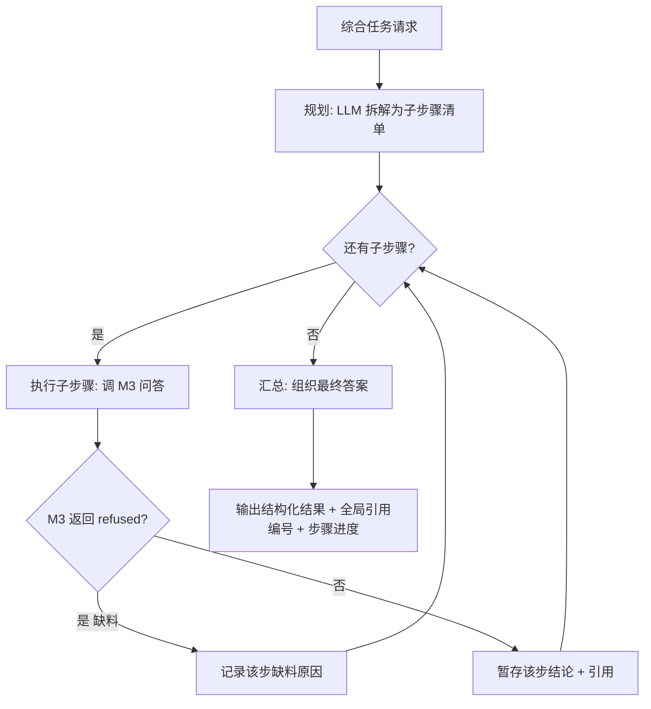

# 05-Agent 多步工作流设计（v0.2 草案）

| 字段 | 内容 |
|---|---|
| 状态 | 草案（本层决策 AW1–AW5 已拍板） |
| 版本 | v0.2 |
| 日期 | 2026-09-10 |
| 上游 | `01-requirements.md`（PRD v0.4 §4.3 流程图）· `02-modules.md`（M4 边界）· `04-retrieval.md`（检索链路，被复用） |
| 变更 | v0.2：AW1–AW5 拍板并入 §5 决策记录 |

> 本文回答：跨文档综合任务如何拆步、执行、记录缺料、汇总——以及 M4 与 M3 的边界在哪。

## 1. 范围与边界（红线）

M4 是**编排者**，不是第二个 RAG：

| 属于 M4 | 不属于（复用 M3） |
|---|---|
| 任务目标拆解（规划步骤清单） | 单步检索与生成（M3 的 retrieve + generate） |
| 子步骤循环调度与顺序控制 | 切分与向量化（M2） |
| 每步缺料判定与记录 | 库/文档 CRUD（M1） |
| 跨步汇总与最终结构化输出 | 拒答判定规则（M3 的 L1/L2） |
| 执行进度对用户可见 | —— |

**红线理由**（02 §3）：若 M4 自己实现检索，会出现两套检索逻辑（参数、拒答阈值分裂），检索质量再也无法统一评估。

## 2. 工作流全景

> 图注：与 01 §4.3 一致——规划 → 循环执行（每步复用一个完整的 M3 问答）→ 汇总；
> 每步都产出「有料结论 + 引用」或「缺料记录」，最终答案是这些步骤的组合。



## 3. 各阶段设计

### 3.1 规划（Planning）

- **输入**：用户任务（如"总结我在 TCP 上记过哪些知识点，逐条给出出处"）+ 可选库范围。
- **输出**：结构化步骤清单（JSON）：每步含 `goal`（该步要查什么）与 `query`（检索用的问题）。
- **做法**：LLM 生成，要求输出 JSON 数组（失败则退化为「单步 = 原任务」，不阻断用户）。
- **约束**：步骤数上限（见决策 AW2）；每步必须是**可独立检索的问题**（不能是"接着上一步继续"这类指代）。

### 3.2 执行（Execution）

- 逐步调用 M3 的问答能力（同一库范围）。
- **每步结果三态**：
  - `answered`：M3 正常回答 → 暂存结论 + 引用
  - `insufficient`：M3 返回拒答（low_relevance / empty_kb）→ 记录缺料（该步查到什么范围、为什么没料）
  - `error`：LLM 不可用等技术故障 → 记录错误，**继续后续步骤**（不因单步故障整体失败）
- **顺序执行**（MVP）：步骤间无依赖并行需求，串行更易追踪与排错。

### 3.3 缺料记录（关键差异点）

这是 M4 与"一次生成"的本质区别：**每步都能说清"哪一步没查到"**，而不是笼统地答不好。

```text
第 2 步「拥塞控制的具体算法」：知识库无相关内容（检索到的最高相似度 0.21 < τ 0.35）
```

### 3.4 汇总（Synthesis）

- 输入：各步骤的结论 + 引用 + 缺料记录。
- 输出：结构化结果（分步列出结论），**引用编号全局统一**（跨步连续编号，前端可逐条溯源）。
- 汇总由 LLM 完成，但**引用仍走 M3 的越界校验**（复用同一套纯规则，防幻觉）。
- 缺料步骤在最终结果中显式标注（US-M4-02）。

### 3.5 进度可见（US-M4-01）

- MVP：同步执行，接口**一次返回完整步骤清单 + 每步状态 + 最终答案**（前端可展示"执行了哪几步、每步结果"）。
- 演进（V1.0）：异步执行 + 轮询/SSE 推送步骤进度（与 M2 的任务状态机同款思路）。

## 4. 数据原型与接口（草案）

```python
class WorkflowStep:
    index: int
    goal: str                 # 该步要查什么
    query: str                # 实际用于检索的问题（可能是改写后的）
    status: str               # answered / insufficient / error
    conclusion: str | None    # 该步结论（answered 时）
    note: str | None          # 缺料/错误说明（insufficient / error 时）
    citations: list[Citation]

class WorkflowResult:
    task: str
    steps: list[WorkflowStep]
    answer: str               # 汇总后的最终答案
    citations: list[Citation] # 全局统一编号的引用
```

```text
POST /api/v1/workflow
  请求体: {"task": str, "kb_id": int | "all"?, "max_steps"?: int}
  200: WorkflowResult          # 含每步状态与缺料说明
  400: 空任务 / 知识库为空
  404: kb_id 指定的库不存在
  422: 参数校验失败
```

## 5. 决策记录（2026-09-10 拍板）

| 编号 | 决策（已拍板） | 备选与代价 | 理由 |
|---|---|---|---|
| AW1 | 规划由 **LLM 生成 JSON 步骤清单**，解析失败退化为「单步 = 原任务」 | 固定模板：可控但只能处理预设任务类型 | 综合任务形态不可穷举；退化路径保证规划失败不阻断用户 |
| AW2 | 步骤上限 **默认 5 步**（配置 `workflow_max_steps`） | 不限：LLM 可能拆出十几步，成本与耗时不可控 | 上限保证单次任务可预期；复杂任务由用户分次发起 |
| AW3 | **MVP 同步执行**：一次请求返回全部步骤与最终结果（含每步状态） | 异步 + 轮询/SSE：体验更好但需任务状态机 | 同步实现简单、可测；步骤进度仍在响应结构里对用户可见（US-M4-01）。异步留 V1.0 |
| AW4 | **引用全局统一编号**（跨步连续），汇总时复用 M3 的越界校验 | 每步独立编号：前端需处理多套编号，溯源易混 | 前端只需一套"点 [n] 跳原文"逻辑；防幻觉校验自然复用 |
| AW5 | **显式端点** `POST /api/v1/workflow`，M3 只做单轮问答 | 在 /ask 内部自动识别多步任务 | 职责清晰、行为可预期；自动识别会让 /ask 的响应结构随任务类型漂移 |

## 6. 与评估（06）的关系

- M4 的评估不属于检索质量评估（那是 06 的主体），但可用同一套评估集构造**多步任务**：
  期望"任务 X 应命中文档 A 与 B，且不遗漏 C 主题"。
- 指标：步骤规划合理性（人工抽查）、每步引用正确率、缺料识别准确率。

## 7. 下一步

- AW1–AW5 已拍板 → 建 M4 子 Issue（按 `templates/module-design.md`）→ 实现编排层与 `/workflow` 端点。
- 依赖：M3 的问答能力（`ask.answer_question`）已具备（PR #13–#15）。
