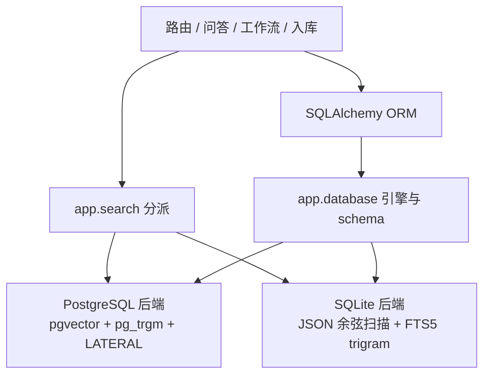

# 09-SQLite 桌面化迁移

| 字段 | 内容 |
|---|---|
| 状态 | 已实现（阶段 1） |
| 版本 | v0.1 |
| 日期 | 2026-09-21 |
| 上游 | `02-modules.md`（模块边界）· `03-data-model.md`（数据模型）· `04-retrieval.md`（检索） |
| 关联 | 桌面 App 化阶段 1：核心存储双方言 |

> 本文记录从 PostgreSQL 服务迁移到 SQLite 嵌入式数据库的边界、当前实现和后续切换顺序。阶段 1 已让核心业务同时运行在两种数据库上；默认启动方式仍保持 PostgreSQL，待数据迁移和启动器切换完成后再删除旧路径。

## 1. 目标与约束

桌面 App 必须随应用启动和退出，不能要求用户维护数据库服务、WSL 或容器。SQLite 文件因此成为目标运行时；Markdown 原文仍是可重建的内容真相，数据库保存元数据、切块、任务状态和检索索引。

迁移遵守三条约束：

1. 每个阶段都能独立回归，`main` 始终可运行；
2. PostgreSQL 基线在切换完成前保持可用，用同一 ORM 和业务测试检查行为等价；
3. 方言差异只能位于 `app/database` 与 `app/search`，路由、问答、工作流和入库管线不拼接方言 SQL。

## 2. 阶段 1 已实现结构



| 能力 | PostgreSQL | SQLite |
|---|---|---|
| 主键 | `BIGINT IDENTITY` | `INTEGER PRIMARY KEY` / rowid |
| embedding 列 | `vector(1024)` | JSON 数组 |
| 向量召回 | pgvector cosine，HNSW | 进程内精确余弦扫描 |
| 关键词召回 | `pg_trgm` GIN + similarity | FTS5 trigram + bm25；不足 3 字符用转义 LIKE |
| 关联图 | LATERAL 跨文档近邻 | 确定性精确余弦扫描 |
| schema | Alembic | `app_metadata.schema_version` |
| 并发写 | PostgreSQL 事务 | WAL + busy timeout + 单实例约束（后续壳实现） |

SQLite FTS 使用 external-content 表 `chunks_fts`，由 insert/update/delete 触发器与 `chunks` 同步。首次创建索引时执行一次 `rebuild`，因此旧数据不会因为“先有 chunks、后有 FTS”而漏索引。外键在每条连接上显式开启，删除库或文档仍由数据库级联清理块和 FTS 索引。

## 3. 性能边界

SQLite 向量检索当前是精确扫描，适合个人知识库的 MB 到低百 MB 规模。它的价值是结果可解释、零本地扩展和跨平台打包稳定。只有真实评估显示问答或图谱耗时超过预算时，才引入 `sqlite-vec`；插件必须保持可选，FTS5 和精确扫描仍应能独立运行。

图谱继续只选最多 400 个源块，并按 `(chunk_index, doc_id, id)` 轮流取样，避免早期长文档挤掉后导入文档。候选近邻目前扫描库内全部块，后续性能门槛应以真实库测量决定，不能提前牺牲连边正确性。

## 4. 启动与升级语义

设置下面的连接串并直接启动 API，可使用阶段 1 的 SQLite 路径：

```dotenv
DATABASE_URL=sqlite+pysqlite:///./data/knowbase.db
```

应用 lifespan 会幂等创建 v1 schema、启用 WAL、创建 FTS5 索引与同步触发器。数据库版本高于当前程序时拒绝打开，防止旧应用改坏新格式；低于当前版本时也明确要求升级。后续每次 schema 变化必须提供按版本顺序执行、事务化且可重复验证的升级函数，不能用 `create_all()` 假装完成字段迁移。

## 5. 后续阶段与验收门

1. **数据迁移与模型指纹**：记录 embedding 供应商、模型和维度；不匹配时阻止混用并提示重建。提供 PostgreSQL/文件系统到 SQLite 的一次性导入与校验。
2. **默认运行时切换**：默认连接串改为用户数据目录中的 SQLite 文件；启动器删除 PostgreSQL、WSL、Docker 和 Alembic 用户路径。验收为干净机器只装 Python/前端构建产物即可运行。
3. **文件系统可重建**：为原文补稳定元数据，删除数据库后可全量重建；通过 mtime/size 检测外部编辑。
4. **桌面壳**：先用 pywebview 验证 Python、WebView、SQLite、文件监听和单实例锁，再决定 Tauri sidecar 的正式打包。

每一阶段都必须跑 PostgreSQL 全回归、SQLite 真文件集成测试以及 v2 检索基线。默认切换前，不删除 PostgreSQL 实现和迁移文件。
