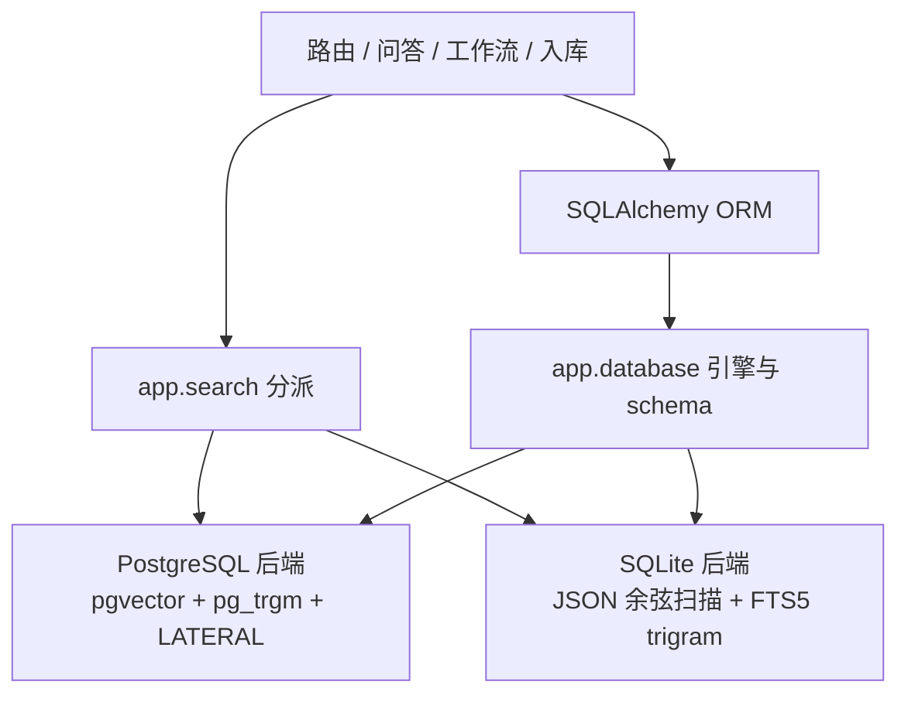
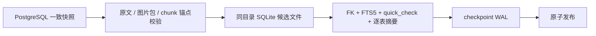

# 09-SQLite 桌面化迁移

| 字段 | 内容 |
|---|---|
| 状态 | 已实现（核心双方言、数据迁移、默认运行时、Vault 可重建、外部编辑同步、可恢复入库任务、Windows 冻结包与本地诊断） |
| 版本 | v1.0 |
| 日期 | 2026-09-25 |
| 上游 | `02-modules.md`（模块边界）· `03-data-model.md`（数据模型）· `04-retrieval.md`（检索） |
| 关联 | 桌面 App 化：核心双方言、模型指纹、质量门、迁移、默认运行时、文件真相、本地窗口与诊断生命周期 |

> 本文记录从 PostgreSQL 服务迁移到 SQLite 嵌入式数据库的边界、当前实现和后续顺序。核心业务、一次性数据迁移和默认启动切换已经完成；PostgreSQL 路径只保留给迁移、兼容回归与评估对照。

## 1. 目标与约束

桌面 App 必须随应用启动和退出，不能要求用户维护数据库服务、WSL 或容器。SQLite 文件因此成为目标运行时；Markdown 原文与 Vault 清单共同组成可重建的内容真相，数据库保存工作副本、切块、任务状态和检索索引。

迁移遵守三条约束：

1. 每个阶段都能独立回归，`main` 始终可运行；
2. PostgreSQL 基线作为迁移与回归对照继续可用，用同一 ORM 和业务测试检查行为等价；
3. 方言差异只能位于 `app/database` 与 `app/search`，路由、问答、工作流和入库管线不拼接方言 SQL。

## 2. 阶段 1 已实现结构

| 能力 | PostgreSQL | SQLite |
|---|---|---|
| 主键 | `BIGINT IDENTITY` | `INTEGER PRIMARY KEY` / rowid |
| embedding 列 | `vector(1024)` | JSON 数组 |
| 向量召回 | pgvector cosine，HNSW | 进程内精确余弦扫描 |
| 关键词召回 | `pg_trgm` GIN + similarity | FTS5 trigram + bm25；不足 3 字符用转义 LIKE |
| 关联图 | LATERAL 跨文档近邻 | 确定性精确余弦扫描 |
| schema | Alembic | `app_metadata.schema_version` |
| 并发写 | PostgreSQL 事务 | WAL + busy timeout + 单实例约束（后续壳实现） |

SQLite FTS 使用 external-content 表 `chunks_fts`，由 insert/update/delete 触发器与 `chunks` 同步。首次创建索引时执行一次 `rebuild`，因此旧数据不会因为“先有 chunks、后有 FTS”而漏索引。外键在每条连接上显式开启，删除库或文档仍由数据库级联清理块和 FTS 索引。

数据库同时保存 embedding 服务地址、模型和维度的规范化指纹。旧库升级后的第一次向量操作采用当前配置并记录；此后只允许空索引自动切换。有现有块时配置不一致，问答在请求新向量前拒绝并提示重建，入库按失败状态机保留旧原文和旧块。检查完成后立即结束只读事务，不会在远程模型等待期间占用连接。

## 3. 性能边界

SQLite 向量检索当前是精确扫描，适合个人知识库的 MB 到低百 MB 规模。它的价值是结果可解释、零本地扩展和跨平台打包稳定。只有真实评估显示问答或图谱耗时超过预算时，才引入 `sqlite-vec`；插件必须保持可选，FTS5 和精确扫描仍应能独立运行。

图谱继续只选最多 400 个源块，并按 `(chunk_index, doc_id, id)` 轮流取样，避免早期长文档挤掉后导入文档。候选近邻目前扫描库内全部块，后续性能门槛应以真实库测量决定，不能提前牺牲连边正确性。

2026-09-21 使用相同 BGE-M3、5 库、20 文档、60 问题重跑：SQLite recall@8 为 1.000（50/50），MRR 为 1.000；PostgreSQL 参考值分别为 1.000 和 0.987。τ=0.50 下两者都是库外拒答率 1.000、库内误拒率 0。`eval.comparison` 把“recall 不下降、MRR 下降不超过 0.01”固化为可执行门，而非人工看两份日志。

## 4. 一次性数据迁移

`app.migration` 把迁移拆成数据规范化、存储完整性、报告与 PostgreSQL →
SQLite 编排四个边界。PowerShell 只负责准备源数据库并调用 Python，不复制
业务规则。迁移顺序如下：

迁移显式复制业务表的每一列并保留 ID；字段清单与 ORM 模型不一致时直接失败，
因此以后新增列不会被旧迁移器静默漏掉。PostgreSQL 带时区时间统一转换为 UTC
后写入 SQLite，pgvector 值规范化为有限浮点 JSON 数组；向量维度取持久化的
embedding 指纹。`app_metadata.schema_version` 由 SQLite 初始化器管理，其余元
数据原样参与摘要。

源库以 `REPEATABLE READ` 读取，并对元数据、知识库、文档和块表加 `SHARE`
锁。迁移期间应用写入会等待，超过锁超时则显式失败。活动文件是不可变版本，
表锁同时阻止删除或切换活动版本；运维流程仍要求先停止 API，以免发布后源库
继续产生新写入。

目标已存在时默认拒绝操作。显式替换会先 checkpoint 旧库，把它改名为带 UTC
时间戳的备份，再发布候选；最终复核失败会撤回候选并恢复备份。报告不保存
数据库 URL、口令、API key 或 embedding base URL。

## 5. 启动与升级语义

普通配置不再写 `DATABASE_URL` 或 `STORAGE_DIR`。运行时按平台选择用户数据目录，并允许用一个 `KNOWBASE_DATA_DIR` 整体覆盖：

| 系统 | 默认目录 |
|---|---|
| Windows | `%LOCALAPPDATA%\KnowBase` |
| macOS | `~/Library/Application Support/KnowBase` |
| Linux | `$XDG_DATA_HOME/knowbase` 或 `~/.local/share/knowbase` |

`app.runtime` 在 API 启动前幂等准备当前 v2 schema、启用 WAL、创建 FTS5 索引与同步触发器，并核对 embedding 指纹、Vault 清单、外键和 `quick_check`；数据库存在时还会同步已登记普通原文的外部修改。v1 会事务化创建任务表并升级到 v2；版本高于当前程序或低于最早可升级版本时拒绝打开。后续每次 schema 变化必须提供按版本顺序执行、事务化且可重复验证的升级函数，不能用 `create_all()` 假装完成字段迁移。

旧 PostgreSQL 迁移产物先落在仓库 `data/knowbase.db`，普通首次启动再通过 SQLite backup API 与原文树双重摘要复制到用户目录。复制使用候选文件/目录，校验活动原文、图片包、chunk 锚点、外键、FTS 和逻辑摘要后才发布；失败清理候选，源文件与已有用户库保持不变。目标库一旦存在，后续启动只复用它，不会再次导入或覆盖。

用户原文目录根部的 `.knowbase-vault.json` 是带格式版本、严格字段校验和 payload SHA-256 的原子清单。它记录知识库和文档主键、名称、时间、入库版本，以及活动/候选原文的相对路径、内容摘要、字符数、大小和 mtime；chunks、向量、任务错误与模型密钥仍属于派生或运行信息，不写入清单。日常 SQLite 的库/文档创建、重传、入库切换和删除统一经过 `app.vault.coordinator`，清单写入和数据库提交串行执行；数据库提交失败时按回滚后的数据库恢复清单，恢复本身失败则停止继续写入并保留原文字节。

数据库文件缺失但 Vault 存在时，启动器不会回退导入仓库中的旧快照。它先验证所有普通原文或图片包，再用保留的业务主键建立同目录候选 SQLite；每篇文档重新切分并调用当前 embedding 服务，候选库通过活动原文、chunk 锚点、外键、FTS、摘要和 `quick_check` 后，清单中的候选原文才提升为活动原文，数据库再以“不覆盖既有目标”的硬链接发布。任一文档失败、清单损坏或并发进程先发布目标时，本进程清理自己的候选，不删除另一进程的文件。已有 SQLite 与清单的用户元数据不一致时启动会停止，防止静默选择错误副本；仅 mtime 改变且内容未变时可刷新观察值。

已有数据库启动时，`app.vault.external_sync` 编排同步，`external_source` 先用 mtime/size 筛选已登记来源，再以 SHA-256 判定普通文本的实际变化；内容未变时只刷新观察值，内容改变时通过共享的 `app.document_index` 切分和向量化，再由 `external_index` 只替换该文档的 chunk 与 FTS 索引。模型调用完成后再次读取原文，避免把调用期间新保存的文本和旧向量组合。新 SourceRecord 和 `ingest_version` 先写入 Vault，SQLite 在随后事务中校验数据库指纹、溯源区间、向量维度和 FTS 完整性；中途退出会留下“数据库落后于 Vault”的唯一可恢复状态，下次启动使用 Vault 版本继续，不重复递增。图片包仍要求 ZIP 重传；来源缺失、重命名、空内容、候选版本冲突与未登记散文件均不猜测用户意图。同步当前只发生在启动阶段，运行中修改在下次启动生效。

外部来源对账完成后，`app.ingest_tasks.service` 再扫描任务表和遗留的
`pending / processing` 文档。上传登记与任务排队处于同一事务；任务领取、阶段更新和
终结均以版本及候选路径为条件。若文档发布已经提交而进程在任务终结前退出，启动只补齐
任务终态；其余任务按文档顺序恢复，普通单篇失败继续下一篇。Vault 一致性故障仍会停止
启动，避免任务状态提交掩盖内容真相问题。任务表属于可重建运行信息，不写入 Vault。

### pywebview 桌面壳与 Windows 冻结包

桌面宿主位于独立的 `app.desktop` 包，不把窗口技术侵入业务层。`instance_lock` 在用户数据库目录持有跨进程操作系统文件锁；`server` 预绑定 `127.0.0.1` 端口，在后台线程启动单 worker Uvicorn，并轮询真实 `/ready`；`launcher` 在持锁期间先调用 `prepare_runtime`，就绪后才在主线程创建 pywebview 窗口。pywebview 的事件循环返回时，托管服务器会执行正常退出并释放 HTTP 连接池、端口和实例锁。启动失败、端口冲突、重复实例与前端构建产物缺失均在创建业务窗口前转成明确错误。

WebView profile 持久化到用户数据目录的 `webview/`，因此浏览器会话不会跟随源码 clone。窗口只加载回环 `/ui/`，TypeScript 前端仍通过原 REST 契约工作。由于回环 HTTP 接口可能被其它网站从浏览器发起请求，应用层增加本地浏览器写保护：请求目标必须是明确的回环主机，带 `Origin` 的非安全方法只接受 API 同源页面或固定的 Vite 开发源 `127.0.0.1:5173` / `localhost:5173`；无 `Origin` 的本机 CLI 继续可用。显式主机白名单同时阻断仅靠 Origin/Host 相等无法识别的 DNS 重绑定域名。这个保护和只监听回环地址共同组成当前本地边界，不代表支持局域网或多用户暴露。

源码形态继续由 `desktop` 可选依赖和快捷方式服务开发调试；Windows 发布物使用 PyInstaller 单目录模式，把 Python、后端、Vite 产物、空白配置模板和 pywebview/.NET 桥接资源冻结到同一目录。入口在导入全局 Settings 前以独占创建方式准备用户目录 `config.env`，升级程序不会覆盖密钥；发布物拒绝包含 `.env`、`config.env` 或用户数据。Uvicorn 复用应用滚动日志配置，避免 windowed 进程没有标准流时默认 formatter 崩溃。

本阶段选择 PyInstaller/pywebview，而没有切换 Tauri sidecar。现有壳已经验证 REST、单实例、WebView2 与 API 生命周期，冻结后约 65 MiB；Tauri 会新增 Rust 工具链、第二进程协议和 sidecar 更新一致性，却不减少 Python/FastAPI 核心运行时。单目录也优先于 onefile：资源结构可检查、启动不需要每次解压，杀毒软件误报与临时目录故障面更小。构建脚本在收缩 PATH、清空 Python 环境变量后，用临时数据目录分别执行 API/SQLite 与隐藏 WebView 页面加载检查，并输出 ZIP 和 SHA-256。真实 Windows Sandbox/独立 VM 的安装升级仍保留为 Releases 门。

### 本地诊断边界

桌面程序没有常驻终端，因此诊断基础设施独立放在 `app.diagnostics`：`local_logging` 只负责 SQLite 日常运行的滚动文件与凭据脱敏，`context`/`middleware` 只负责请求 ID、响应头和请求总耗时，`stages` 为模型/检索/索引提供不含正文的阶段计时，`report` 只组装允许复制的字段。日志配置幂等；桌面启动器先启用日志以覆盖运行时准备，ASGI lifespan 在 Uvicorn 完成自己的 logging 配置后再次确认 handler 仍挂载。

`knowbase.log` 每个文件 2 MiB、4 份备份。日志不记录 HTTP body 与 query string，阶段维度限于库 ID、步骤号、字符/块数量和配置上限；formatter 还会遮盖当前模型 Key、Bearer、常见凭据字段和 URL userinfo。完整异常留在本机，500 响应只返回 request ID。复制报告进一步排除服务地址、知识库/文档名称、问题、回答、原文与绝对路径，仅保留版本、平台、方言/schema、状态计数、模型指纹和构建状态。完整日志仍可能包含现有业务 logger 写出的路径或标题，用户分享前必须检查。

## 6. 后续阶段与验收门

1. **已完成：数据迁移**。PostgreSQL/文件系统到 SQLite 的一次性导入、指纹核对、逐表摘要和失败保护已有真实 PostgreSQL 集成测试。
2. **已完成：默认运行时切换**。默认连接串改为用户目录 SQLite；启动器、演示库和快捷方式移除 PostgreSQL、WSL、Docker 与 Alembic 用户路径。首次导入覆盖 WAL、失败回滚、目标不覆盖和跨平台路径测试。
3. **已完成：文件系统可重建基础**。严格 Vault 清单、事务补偿、数据库删除后候选重建、pending 提升、失败和并发发布保护均有真 SQLite 回归测试。
4. **已完成：外部编辑同步**。mtime/size 廉价筛选、SHA-256 最终判定、单文档索引替换、模型等待期间二次保存保护、Vault 领先后的启动续接和删除/重命名失败关闭均有真 SQLite 回归测试。
5. **已完成：桌面壳原型**。pywebview 已验证 Windows WebView2、SQLite 准备、启动阶段外部同步、跨进程单实例、后台 API 就绪门、关窗退出和同源写保护；自动化测试不依赖真实 GUI，另有本机原生窗口冒烟验证。
6. **已完成：本地诊断**。滚动日志、凭据脱敏、请求 ID、模型/检索/索引阶段耗时、安全 500 和隐私安全复制报告已有 API/文件回归；前端提供单击复制及 Clipboard API 失败回退。
7. **已完成：可恢复入库任务**。任务身份、原子领取、五阶段进度、重复调度、重传竞态、处理中退出、发布后退出、单篇失败隔离和 v1→v2 SQLite 升级均有回归测试。
8. **已完成：Windows 可分发桌面包**。PyInstaller 单目录包、版本/图标资源、用户配置隔离、无标准流日志兼容、API 与真实 WebView 双冒烟、Windows CI 和 ZIP 校验和均已落地。
9. **下一步：正式 Releases 与跨平台发布**。在 Windows Sandbox/独立 VM 验证首次安装和旧 schema 升级，建立 tag 驱动的 Releases 上传与签名说明，再分别设计 macOS 签名/notarization 和 Linux GTK/Qt 产物；不能把 Windows 冻结包直接宣称为三平台完成。

每一阶段都必须跑 PostgreSQL 全回归、SQLite 真文件集成测试以及相关前端检查；检索或存储语义变化还必须通过 v2 质量门。可分发安装包完成前，不删除 PostgreSQL 实现与迁移文件。
